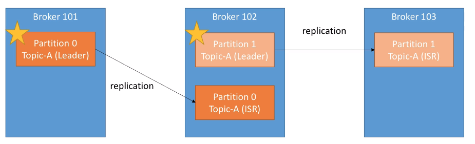
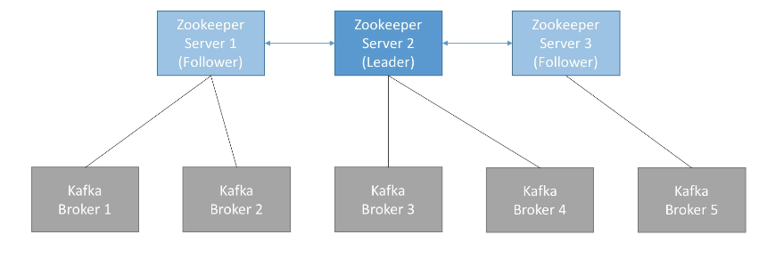
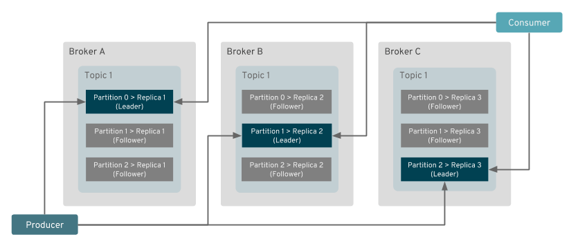
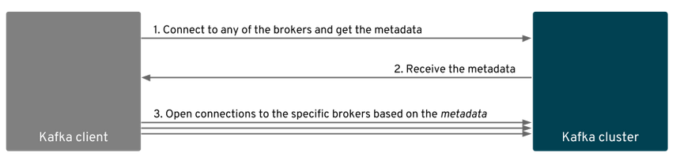

# Brokers

- Kafka cluster is composed of multiple `brokers` (servers)
- Each broker contains only certain partitions of the topic (not all the data)
- Connecting to one broker means connecting to all brokers

## Replication factor

- The partitions of the topics can have replicas
- With a topic `replication factor` = 2, if a broker is down, another broker can serve the same data
- Ideal is a replication factor of 3
- Only one broker can be the `leader` for the partition
  - Only the leader can receive and serve data
  - The other are just backups
  - The other brokers will synchronize the data until it is ISR (in-sync replica)

## Zookeeper

- Zookeeper manages the brokers (keeps a list of them)
- Zookeeper manages configuration about `users`, `topics`, etc
- Zookeeper helps on the `leader election` for partitions
- Zookeeper sends notifications to kafka in case of changes (e.g., new topic, broker dies, broker comes up, delete topics ...)
- Zookeeper operates with odd number of servers (3,5,7)
- Zookeeper also have a `leader server` (handle writes) and the other servers are `followers` (handle reads)

## Kafka discovery protocol

- The clients writing/reading to/from a given `partition` have to `connect directly to the leader broker` which is hosting it
- The `clients already know the broker` to which broker it wants to connect to! This way brokers don't need to do any forwarding
- The only data traffic between brokers is due to replication!

- **Kafka Discovery Protocol** is used by the client to know to which broker to connect to
- First the client connects to any broker and `asks for metadata` (of one or more topics)
- The metadata contains `information` about the `topic`, its `partitions` and `brokers` hosting these partitions.
- All the brokers have the metadata for all topics! They are synced through Zookeeper

- The broker address (in the metadata) can be created by the `broker hostname` or configured by the user using the `advertised.listeners` option
  - The client will use this address to connect to the correct broker

## Bootstrap

- `Bootstrap` are addresses by which the clients can consult the cluster metadata
- Metadata can be, for example, the list of all brokers
- Kafka broker is also called `bootstrap server`: Connecting to one broker connects to all the brokers
- Each broker knows all about the other brokers (topics, partitions, etc)

## Hack awareness

- You want to have multiple brokers in `different data centers (racks)`
- Don't run zookeeper and kafka on the same server

## Monitoring

- Kafka exposes metrics through `JMX`
- Common places to host the kafka metrics
  - ELK (ElasticSearch + Kibana)
  - Datadog
  - NewRelic
  - Confluent Control Centre
  - Prometheus
- Important metrics
  - `Under Replicated Partitions`: May indicate a high load on the system
  - `Request Handler`: utilization of threads for IO, network, etc. Overall utilization of the resources of the brokers
  - `Request Timing`: How long it takes to reply to requests

## Administrative operations

- `Rolling restart of brokers`
- `Updating configurations`
- `Rebalancing Partitions`
- `Increasing replication factor`
- `Adding brokers`
- `Replacing broker`
- `Upgrading a kafka cluster` (zero downtime)
