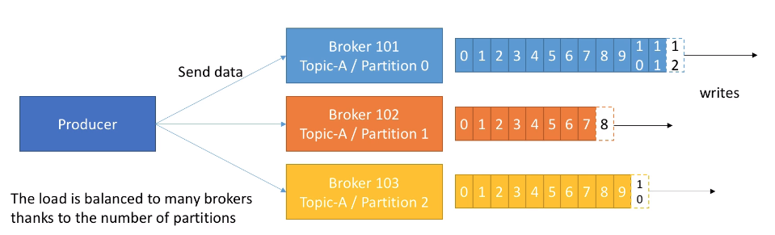
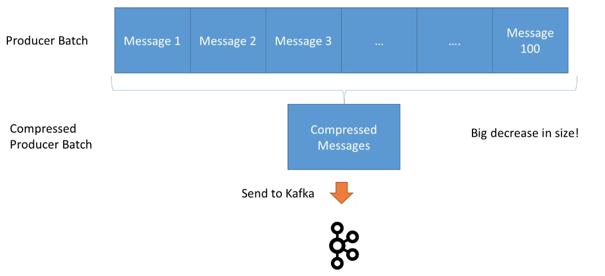
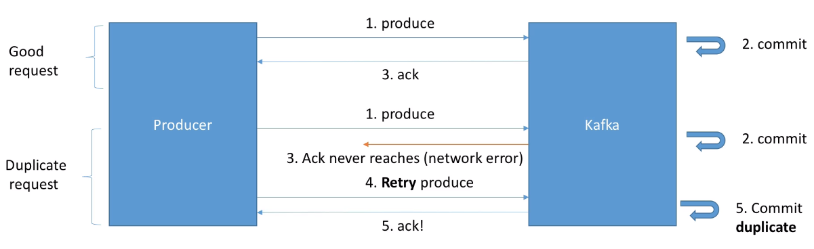
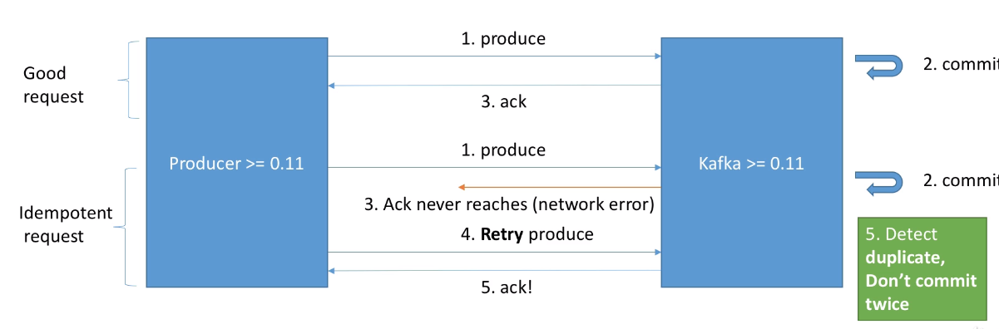

# Producer

- Producers `write data` to topics
- Producers know to which broker and partition to write to

## Message Keys

- Producers can choose to send a `key` with the message
  - if `key=null`, data is sent `round robin` to the brokers
  - if `key!=null`, all messages with same key go to the same partition (good for message ordering if idempotence is enabled and if the number of partitions is not changed)
- Keys are hashed using the `murmur2` algorithm
  - You can change how messages are distributed along partitions (`partitioner.class`) - although not recommended
  - Default: `targetPartition = Utils.abs(Utils.murmur2(record.key())) % numPartitions`
  - If the number of partitions change, messages start going to different partitions

## Serialization

- The producer is responsible for serializing the record
- `Serialize` is to transform a data into an interoperable format. E.g., json, avro, protobuf

## Schema

- Schema in Kafka is the `contract`. Just like `WSDL` for SOAP, `Swagger/OpenAPI` for REST
- The `schema` is defined by the producer. And must be known by the consumer
- For avro, the schema itself is not sent in record! The message contains only the data

## Message batches

- Batches have higher compression ration (better efficiency)
- `Linger.ms`: time to wait before sending a batch out (defaults to 0, no waiting). Good between 5 and 20 ms
- `Batch.size`: maximum batch size, after it reaches sends the batch right away (even if the linger period has not been reached)

## CorrelationID

- It's an ID that represents a message
- This id is shared by all the parts that interact with a message

## Message compression

- Much smaller producer request size (up to 4x)
- Producers and Consumers must use CPU to process the compression
- Compression types
  - `none`: default
  - `gzip`: better compression (more cpu utilization)
  - `snappy`: great for text based messages (e.g., json). Made by google
  - `lz4`: good balance CPU/compression ratio

## Acknowledgment

- Producers can receive `ack` of data writes
- `acks=0`: producer won't wait for ack (possible data loss) - dangerous!
- `acks=1`: producer wait for leader ack (limited data loss) - default
- `acks=all`: Leader and all replicas ack (no data loss)

## Idempotent Producer

- Classic producer

- Idempotence guarantees no duplicity of a single message (send many and they can be saved by parts)
- The idempotent producer has a `produce request id` and it's blocked by kafka when duplicated

- `enable.idempotence=true` automatically sets the following configs
  - `retries`: max_int
  - `max.in.flight.requests`: 5 (but guarantees the ordering!)
  - `acks`: all
