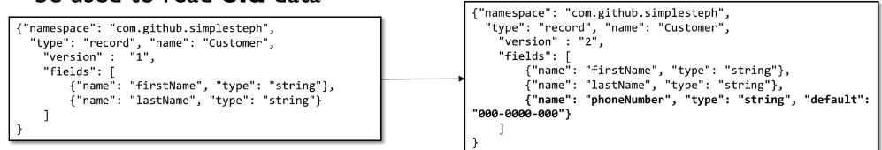
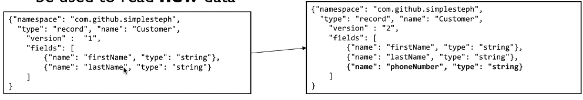
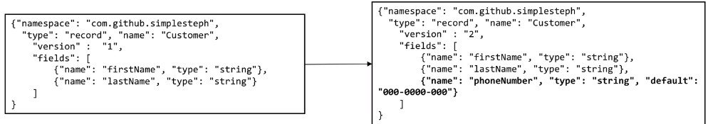
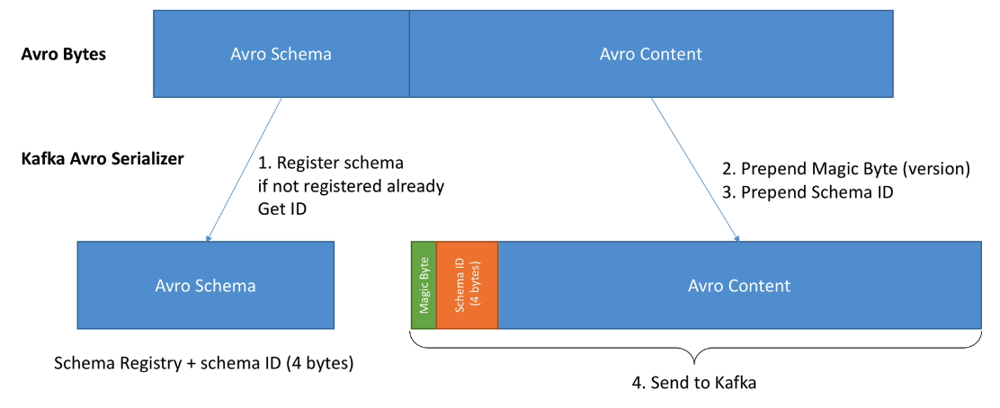

# Schema Registry

- Server process external to Kafka Brokers
- Maintains a database of schemas in the topic `_schemas`
- Has its own Consumer/Producer API component to fetch schemas
- A schema defines the `structure of the data` format
- The advantage of having a schema is that it clearly specifies the structure, the type and the meaning (through documentation) of the data.
- With a schema, data can also be encoded more efficiently.
  - E.g., avro, thrift, protobuf, json

## Subject

- The SR defines a scope in which schemas can evolve, the scope is named `subject`
- The name of the subject depends on the `subject name strategy`
  - The subject name strategy can be modified on a per-topic basis
  - The default subject name strategy is `topic-value` and `topic-key`

## Compatibility rules

- A schema `compatibility rule` can be defined per topic

1. If a schema is the same as the last message produced -> Success
1. If a schema is different from last message but matches the compatibility -> Success
1. If a schema is different from last message but violates the compatibility -> Fail

- The schema registry **does NOT impede the producer/consumer from producing/consuming a message with incompatible schema**
  - Rather it alerts the application that they are doing so

### Schema Evolution

- **Backward**: new schema can be used to read old data. v2 can read v1
  
  - Only add fields with defaults
  - Updating your consumers to V2 you will still be able to read V1 producer data
- **Forward**: old schema can be used to read new data. v1 can read v2
  
  - Only remove fields that have defaults
  - Updating your producers to V2 won't break your V1 consumers
- **Full**: both backward and forward
  
  - Only add fields with defaults
  - Only remove fields that have defaults
- **Breaking (none)**: none of those
  - Add/Remove elements from an Enum
  - Change type of a field
  - Rename a required field (without default)
- `Rules`
  1. Make your primary key required (no default)
  1. Give default values to all the fields that could be removed in the future
  1. Be very careful when using enums. Enums can't evolve over time
  1. Don't rename fields. You can add aliases instead
  1. When evolving a schema, always give default values (backward compatible)
  1. When evolving a schema, never delete a required field (forward compatible)

## Confluent schema registry

- `Avro Schema`: Goes to schema registry
- `Magic Byte`: Version of the schema
- `Schema ID`: ID of the schema in schema registry
- `Avro Content`: Payload



```yaml
version: "2"
services:
  kafka-cluster:
    image: landoop/fast-data-dev:cp3.3.0 # Kafka + Schema Registry + REst Proxy
    environment:
      ADV_HOST: 127.0.0.1 # Change to 192.168.99.100 if using Docker Toolbox
      RUNTESTS: 0 # Disable Running tests so the cluster starts faster
      FORWARDLOGS: 0 # Disable running 5 file source connectors that bring application logs into Kafka topics
      SAMPLEDATA: 0 # Do not create sea_vessel_position_reports, nyc_yellow_taxi_trip_data, reddit_posts topics with sample Avro records.
    ports:
      - 2181:2181 # Zookeeper
      - 3030:3030 # Landoop UI
      - 8081-8083:8081-8083 # REST Proxy, Schema Registry, Kafka Connect ports
      - 9581-9585:9581-9585 # JMX Ports
      - 9092:9092 # Kafka Broker
```

## Schema Registry API

```shell
# Register a new version of a schema under the subject "my-topic-value"
curl -X "POST" "http://localhost:8081/subjects/my-topic-value/versions" \
  -H "Content-Type: application/vnd.schemaregistry.v1+json" \
  --data '{"schema": "{\"type\": \"string\"}"}'

# Check whether a schema has been registered under subject "my-topic-value"
curl -X "POST" "http://localhost:8081/subjects/my-topic-value" \
  -H "Content-Type: application/vnd.schemaregistry.v1+json" \
  --data '{"schema": "{\"type\": \"string\"}"}'

# Test compatibility of a schema with the latest schema under subject "my-topic-value"
curl -X "POST" "http://localhost:8081/compatibility/subjects/my-topic-value/versions/latest" \
  -H "Content-Type: application/vnd.schemaregistry.v1+json" \
  --data '{"schema": "{\"type\": \"string\"}"}' \
```

```shell
# List all subjects
curl -X "GET" "http://localhost:8081/subjects"

# List all schema versions registered under the subject "my-topic-value"
curl -X "GET" "http://localhost:8081/subjects/my-topic-value/versions"

# Fetch version 1 of the schema registered under subject "my-topic-value"
curl -X "GET" "http://localhost:8081/subjects/my-topic-value/versions/1"

# Fetch the most recently registered schema under subject "my-topic-value"
curl -X "GET" "http://localhost:8081/subjects/my-topic-value/versions/latest"

# Fetch a schema by globally unique id 1
curl -X "GET" "http://localhost:8081/schemas/ids/1"
```

```shell
# Delete version 3 of the schema registered under subject "my-topic-value"
curl -X "DELETE" "http://localhost:8081/subjects/my-topic-value/versions/1"

# Delete all versions of the schema registered under subject "my-topic-value"
curl -X "DELETE" "http://localhost:8081/subjects/my-topic-value"
```

```shell
# Get top level config
curl -X "GET" "http://localhost:8081/config"

# Update compatibility requirements globally
curl -X "PUT" "http://localhost:8081/config" \
  -H "Content-Type: application/vnd.schemaregistry.v1+json" \
  --data '{"compatibility": "NONE"}'

# Update compatibility requirements under the subject "my-topic-value"
curl -X "PUT" "http://localhost:8081/config/my-topic-value"
  -H "Content-Type: application/vnd.schemaregistry.v1+json" \
  --data '{"compatibility": "BACKWARD"}'
```
