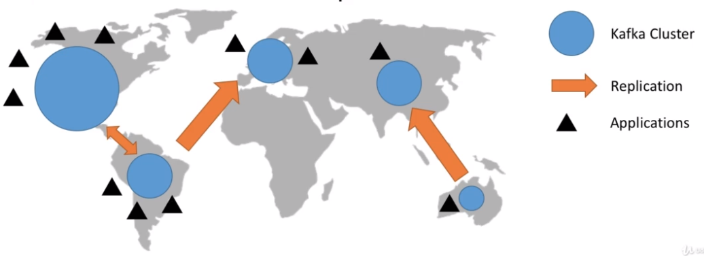

# Mirror Maker

- Kafka can only operate well in a single region
- It's common to have kafka cluster across the globe and replication between them
- `Mirror Maker` is an open source tool that ships with Kafka
  - Netflix uses `Flink` (paid)
  - Uber uses `uReplicator` (open)
  - Comcast uses their own kafka connector source for this (open)
  - Confluent uses their own kafkaconnector source (paid)

- Replication does not preserve the offsets!

## Cluster replication designs

