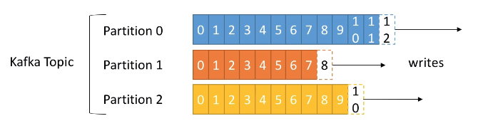
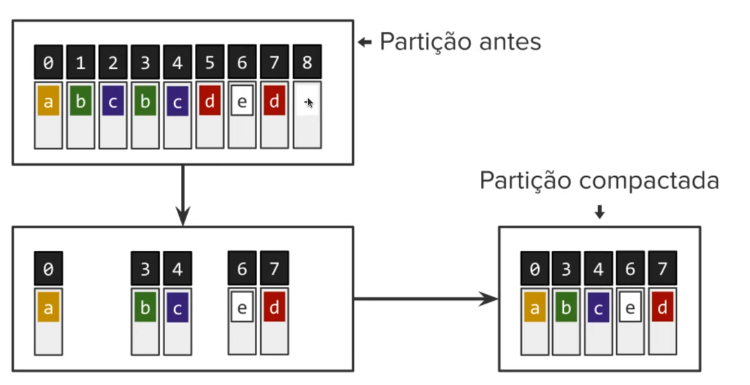
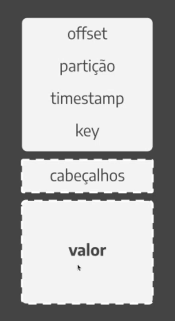
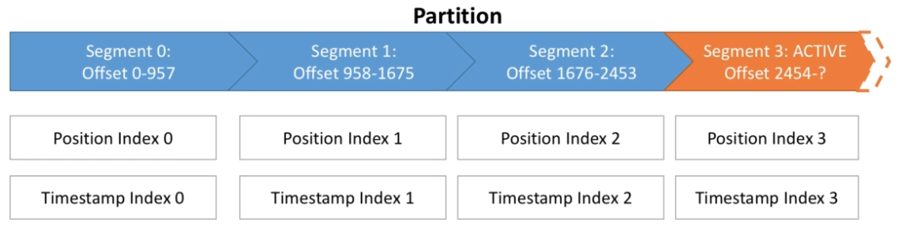
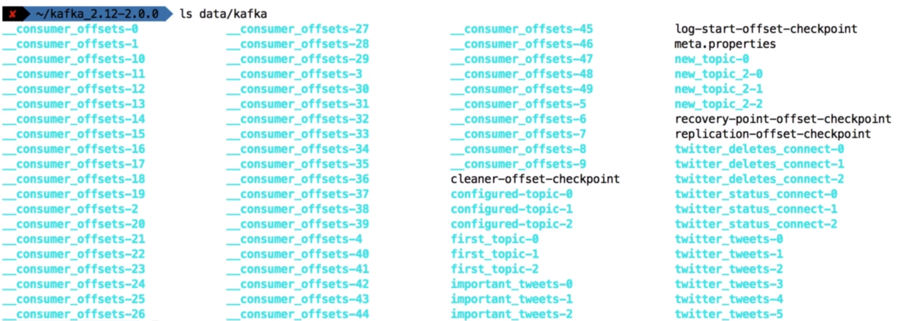

# Topics

- Topic is a `stream of data`
- Events can be `published` to topics and systems can `subscribe` to a topic
- Topics have multiple `partitions` and the data is spread across the partitions
- Each data message in a partition is given a unique incremental id called `offset`

## Partitions

- The number of partitions is specified at the topic creation
- Each partition is a folder in the kafka log directory
  - E.g., my-topic-0, my-topic-1, my-topic-2
- Order of messages is guaranteed only within a partition
- Partitions can be added, but never deleted
- Read/write happens only on the `leader partition`
- If the leader partition fails, kafka will look for the replica partition most updated (`higher watermark`) and elect it the new leader
- Setting the number of partitions equals to the number of brokers is a good choice
- It's agreed that a broker should not container more than 2000-4000 partitions (across all topics of that broker). If that happens, you must increase the number of brokers
- A kafka cluster should not contain more than 20000 partitions (across all topics of all brokers). That causes zookeeper to perform many leader elections

## Offsets

- Each message within a partition has an incremental ID (`offset`). Zero indexed
- By default, the offset is kep for one week
- Data written to a partition can't be changed (`immutability`)
- Data is assigned randomly to a partition unless a key is provided
- Offsets have cleanup policy `delete` or `compact`

## Record

- A record is a block of data in Kafka
- Data persistency of data in Kafka

- `Header` and `value` are only useful for the application consuming it. Kafka never reads it.
  - `Header`: Metadata created by the producer that will be read by the consumer. E.g., uuid
  - `value`: Value itself
- `Offset`, `partition`, `topic`, `timestamp` and `key` are the metadata or the record. It is read by kafka.
  - `Offset` is the only one thing that is specified by kafka when reaching the kafka cluster
  - `Partition` is specified at the producer (before even reaching kafka). The producer knows the best partition by frequently communicating with the bootstrap server and receiving its metadata
  - `Topic` to be stored
  - `Timestamp` defined by the producer
  - `Key` defined by the producer. Messages with same keys go to the same partition

## Segments

- Topics are made of partitions and partitions are made of `segments` (files)

- Only one segment is activate (the one data is being written to)

- Important broker properties

  - `log.segment.bytes`: default size of a single segment (defaults to 1GB)
  - `log.segment.ms`: time to wait before committing (closing) the segment (if not full). Defaults to 1 week

- Segments come with 2 indexes (files)

  - `index`: allows kafka to find messages by offset number
  - `timeindex`: allows kafka to find messages by timestamp

- Segments are stored at the `data/kafka` folder

  - One folder for each partition
    
  - Each partition folder has the segment files
    - `0000000.log`: segment
    - `0000000.index`: index
    - `0000000.timeindex`: timestamp index

- A smaller log.segment.bytes means
  - More segments per partition
  - Log compactation happens more often
  - Kafka has to keep more files opened

## Log Cleanup Policies

- `log.cleanup.policy=delete`: delete data based on its age or size
- `log.cleanup.policy=compact`: delete data based on the keys (keep only the newer keys). The compactation happens only after the segment is closed. After the compact cleanup, a new segment is created with only the non duplicate records

- When to cleanup (which hits first)
  - `log.retention.hours`: tells after which period the cleanup must happen (defaults to 1 week)
  - `log.retention.bytes`: maximum size of each partition before deleting it (defaults to -1)

## Unclean leader election

- If all in sync replicas die, but you still have out of sync replicas up, you can 2 options
  - Wait for the ISR to come back online (default)
  - Enable `unclean.leader.election=true` to start producing to non ISR partition (uses the higher watermark). All new messages on ISR will be discarded
