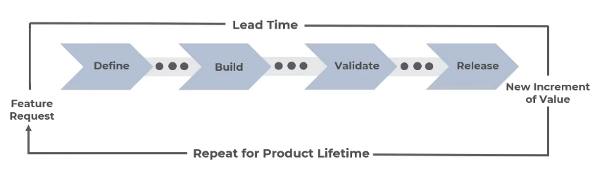

# Scaled Agile Framework (SAFe)

- `Workflow patterns` to implement agile mindset at scale in an organization
- Framework that incorporates `Lean`, `Agile`, `DevOps`
- <https://www.scaledagileframework.com/>
- Benefits
  - Faster `time to market`
  - Increase in `productivity`
  - Increased employee `engagement`
  - Improvements in product `quality`

## Configuration

- **Essential SAFe**
  - Minimum set of `roles`, `events` and `artifacts`
  - ART is the heart
- **Large Solution SAFe**
  - Includes Essential SAFe
  - Requires sync across multiple PIs
  - Previously referred as `value stream level`
- **Portfolio SAFe**
  - Includes Essencial SAFe
  - Organize the flow of value through one or more value streams
- **Full SAFe**
  - Includes Essencial SAFe
  - Includes Large Solution SAFe
  - Includes Portfolio SAFe

## Core Values

1. **Alignment**: keep pace with the fast changes
1. **Built-in-Quality**: product quality standards
   - Architecture
   - Design
   - Code
   - System
   - Release
1. **Transparency**: trust-building behavior
1. **Program Execution**: continuously deliver value

## Core Principles

1. Take an `economic view`
   - Economic impact of choices
1. Apply `system thinking`
   - Understand the big picture of the system
1. `Assume variability`; preserve options
   - Variability is inevitable, have a plan to overcome it and remain flexible
1. `Build incrementally` with fast with fast integrated learning cycles
   - Implement the iterations
1. Base `milestones` on objective evaluation of working systems
   - Every milestone (a increment of value) contains all the requirements (design, testing, etc)
1. Visualize and `limit WIP`, `reduce batch sizes`, and manage queue lengths
   - Achieve a continuous state of flow
1. Apply `cadence`, synchronize with cross-domain planning
   - Join your progress with the progress of other teams
1. Unlock the intrinsic `motivation` of knowledge workers
   - Promoting engagement
1. `Decentralize` decision-making
   - Reliable decision-making framework
1. Organize around `value`
   - Value increment is the focus

## Core Competencies

1. **Team and Technical Agility**
   - Agile Team
   - Deploy value in the iterations
1. **Agile Product Delivery**
   - Customer centric & Design Thinking
   - Develop on cadence & Release on demand
   - DevOps & CI/CD
1. **Enterprise Solution Delivery**
   - Lean System & Solution Engineering
   - Coordinate ARTs and Suppliers
   - Continually evolve live systems
1. **Lean Portfolio Management**
   - Value Stream
   - Portfolio Vision
   - Strategic Themes
   - Allocate money to the most viable thing
1. **Organizational Agility**
   - Lean-thinking People & Agile Teams
   - Lean Business Operations
   - Strategy Agility
1. **Continuous Learning Culture**
   - Leaning Organization
   - Innovation Culture
   - Relentless Improvement
1. **Lean-Agile Leadership**
   - Foundation layer
   - SAFe Program Consultant (SPC): evangelize safe
   - Leading by Example
   - Mindset & Principles
   - Leading Change

## Spanning Palette

- Plays at any level configuration!

- Vision
- Roadmap
- Milestones
- Shared Services
- CoP
- System Team
- Lean UX
- Metrics

## House of lean

- `Roof`: value
- `Pillars`:
  - Respect of people and culture
  - Flow
  - Innovation
  - Relentless Improvement
- `Base` (foundation): Leadership

## Value Stream

- It's everything involved to create a `product`
- It's the sequence of activities needed to convert hypothesis into solution
- Activities
  1. `Define`
  1. `Build`
  1. `Validate`
  1. `Release`
- The sum of times is the `lead time`

- Development Value Stream
- Operational Value Stream

