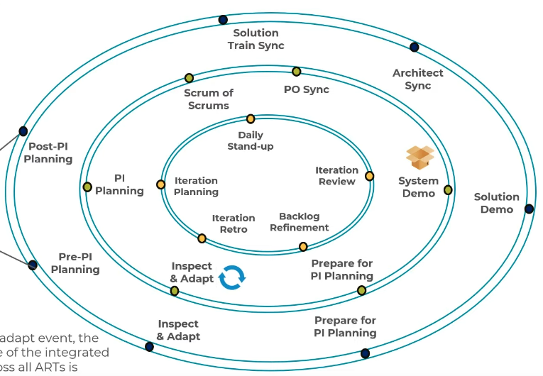

# Solution Train

- The `Solution Train` is powered by `multiple ARTs`
- The solution train is introduced in the Large Solution configuration
- `Fixed cadence`: All ARTs share the same start/end dates

## ST Roles

- `Supplier`
  - Deliver components which help the Solution Train to deliver solution
  - Long Term Business Partners
- `Solution Architect/Engineer`
  - Architecture across ARTs
- `Solution Manager`
  - Content authority on what gets built
- `Solution Train Engineer` (STE)
  - Coaches and facilitates the events

## ST Artifacts

- **Capability**
  - Higher level solution behavior
  - It's a feature that spans across multiple ARTs
- **Solution backlog**
  - Contains the `program backlog` (PM) and the `team backlog` (PO)
  - Holds upcoming capabilities and enablers
  - These capabilities can span multiple ARTs
- **Solution Epics**
- **Nonfunctional Requirements** (NFR)
- **Enabler Capabilities**

## ST Events

### Post-PI Planning

- Follow up after PI Planning

### Solution Train Sync

- Solution Train Sync

### Architect Sync

- Architect Sync

### Solution Demo

- `Show the results` of all the developments efforts from all ARTs

### Prepare for PI Planning

- Prepare for PI Planning

### Inspect & Adapt

- `Current state` of the integrated solution across all ARTs is `demonstrated` and `evaluated`

### Pre-PI Planning

- Prepare for PI Planning
