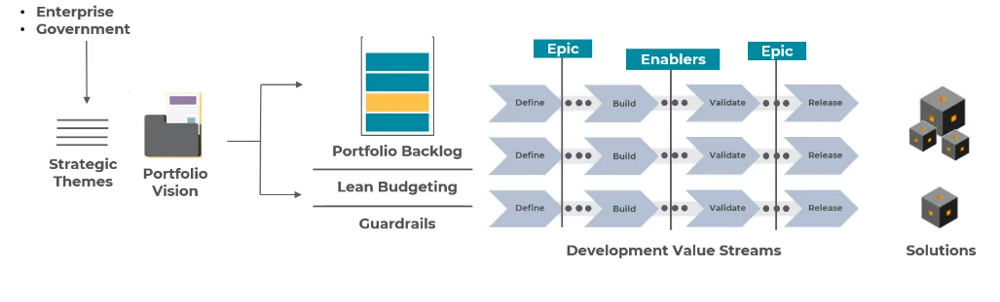

# Portfolio

- Align strategy with execution
- Organize the solution development around the flow of `value streams`

## Portfolio Roles

- **Lean portfolio management**
  - Individuals with highest level of decision-making and financial accountability
- **Epic Owner**
  - Responsible for coordinating the epics
- **Enterprise Architects**
  - Technical directions across value streams
  - Optimize portfolio outcomes

## Portfolio Artifacts

- **Portfolio Backlog**
  - Highest-level backlog in SAFe
  - Epics required to create a portfolio solution
- **Guardrails**
  - Describe portfolio policies for budgeting, spending and governance
- **Portfolio Vision**
  - Description of the future state of a portfolio's value streams and solutions
  - It's defined by the `strategic themes`
- **Business and Enabler Epics**
  - Cooperation across value streams
  - Business level
  - Broad view of activities
- **Portfolio Canvas**
  - Critical inputs to the vision

## Portfolio Events

### Portfolio Sync

- Visibility into how well the portfolio is progressing towards the strategic objectives

### Strategic Portfolio Review

- Achieve and advance the portfolio vision
- Quartely cadence. One month before next PI planning

### SAFe Participatory Budgeting

- Group of stakeholders decide how to invest the portfolio budget across solutions and epics
