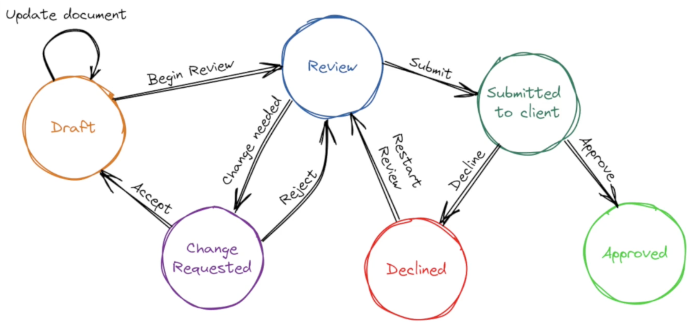

# Finite state machine (FSM)

- It's a computational model that describes a system with a fixed set of `states`, where `transitions` between states are triggered by `inputs or events`.
- It's a directed graph

- **States** - discrete configurations the system can be in (e.g., idle, loading, error)
- **Transitions** - rules for moving from one state to another
- **Inputs/Events** - what triggers a transition (e.g., submit, timeout)
- **Initial state** — where the machine starts (and optionally, accepting/final states)

## Analysis

- **Reachability analysis** — graph traversal (BFS/DFS) can determine if a state is reachable from the initial state, or if dead states exist
- **Cycle detection** — identifies infinite loops (e.g., a retry loop that never terminates)
- **Minimization** — FSM minimization algorithms (like Hopcroft's) work on the graph structure to merge equivalent states
- **Visualization** — tools like Mermaid and XState render FSMs as literal node-edge diagrams
