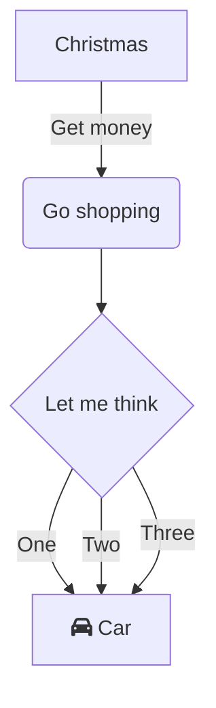

# Flowchart

```mermaid
flowchart TD
  A[Christmas] --> |Get money| B(Go shopping)
  B --> C{Let me think}
  C --> |One| D[Laptop]
  C --> |Two| D[iPhone]
  C --> |Three| D[fa:fa-car Car]
```

## Directions

- `LF`: left-to-right
- `BT`: bottom-to-top

## Blocks

- `A[block]`: square
- `A(block)`: round
- `A{block}`: diamond

## Labels

- `A --> |Do something| B`
