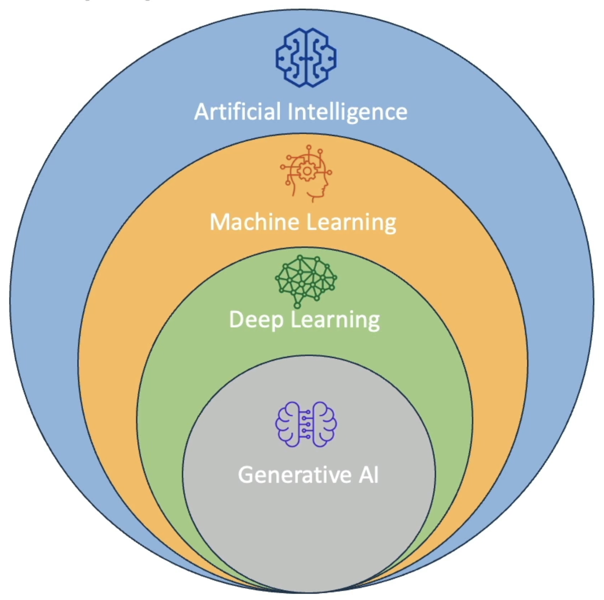

# Artificial Intelligence

## Timeline

- **1950s**
  - Alan Turing proposing the `Turing Test`
    > A machine has intelligence if it's able to have a conversation with a human and fool the human into thinking that the human is speaking to another human
  - John MacCarthy coins the term "Artificial Intelligence"

- **1970s**
  - `Expert systems` created
  - `MYCIN`: AI rule-based system to detect bacteria

- **1990s**
  - Machine Learning & Data Mining
  - 1997 IBM's `Deep Blue` defeats the world chess champion Garry Kasparov

- **2010s**
  - Deep Learning
  - 2016 Google's `AlphaGo` defeating Go champion Lee Sedol

- **2020s**
  - Virtual assistants
  - Autonomous vehicles
  - Healthcare diagnostics
  - Fraud detection
  - Discussions on ethics and regulations

## Model workflow

1. Train a model with a training dataset
2. AI model is created
3. The model is used to evaluate a new data
