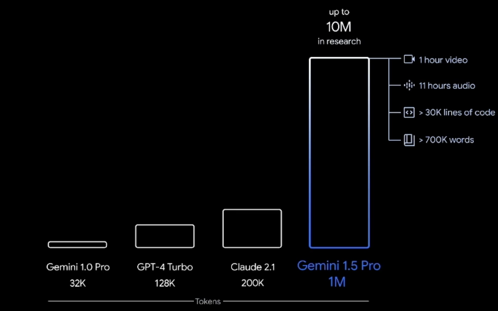

# Generative AI

- `Generate new data` similar to the data it was trained on

## Foundation Model (Base Model)

- Foundation Models are trained on a wide variety of input data
- Foundation models may cost tens of millions of dollars to train

- **Open AI**: GPT-4o
- **AI21 Labs**: Jurassic-2
- **Anthropic** Claude
- **Stability AI** Stable Diffusion
- **Amazon** Amazon Titan
- **Cohere** Command
- **Meta** Llama 2
- **Mistral AI** Mistral

## Generative modality

- Text
- Image
- Vision
- Embedding

## Large Language Models (LLM)

- _Text To Text_
- Relies on a foundation model
- Designed to generate coherent **human-like text**
- We usually interact with LLM via a `prompt`
- The generated text is `non-deterministic`

## Diffusion Models

- _Text To Image_
- Trains using a forward `diffusion process`
  - Adds noise to the image
- Generates image from noise
  - Reverse the `diffusion process`

## Context Window

- The number of tokens an LLM can consider when generating text (the "size" of your prompt)
- Large context windows require more memory and processing power

