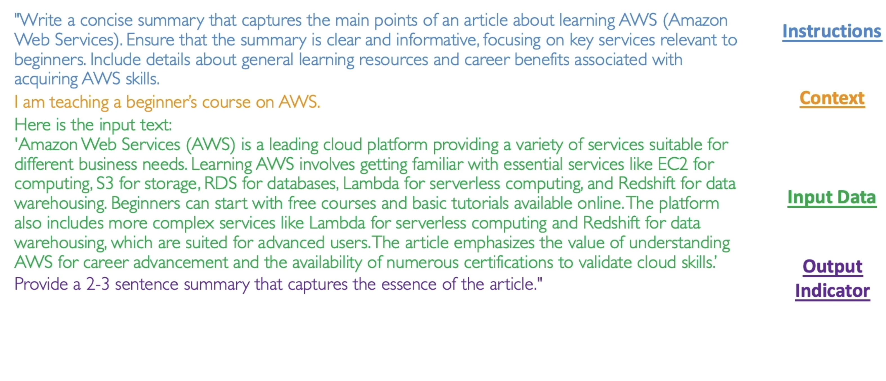
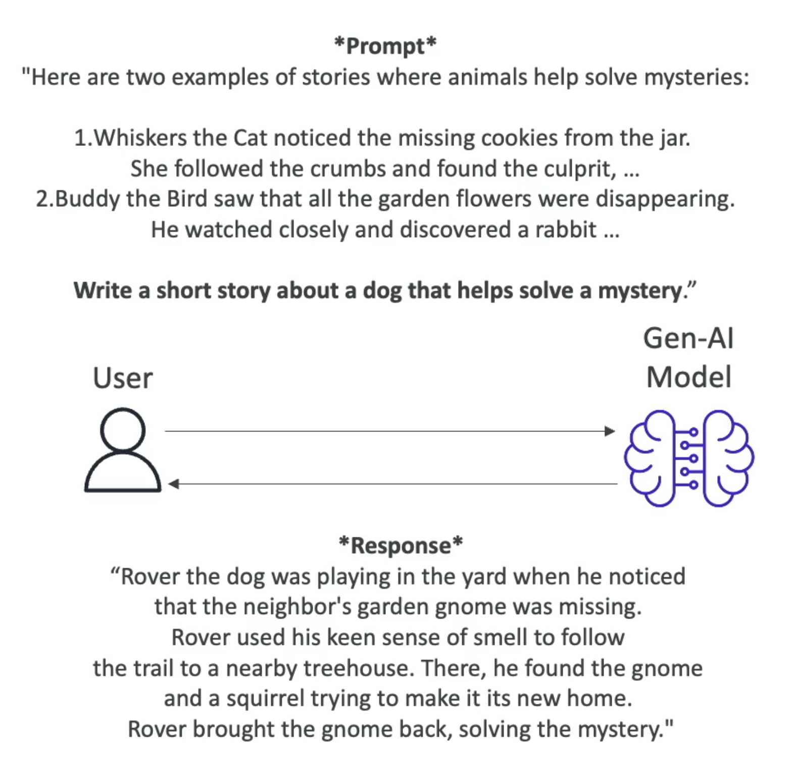
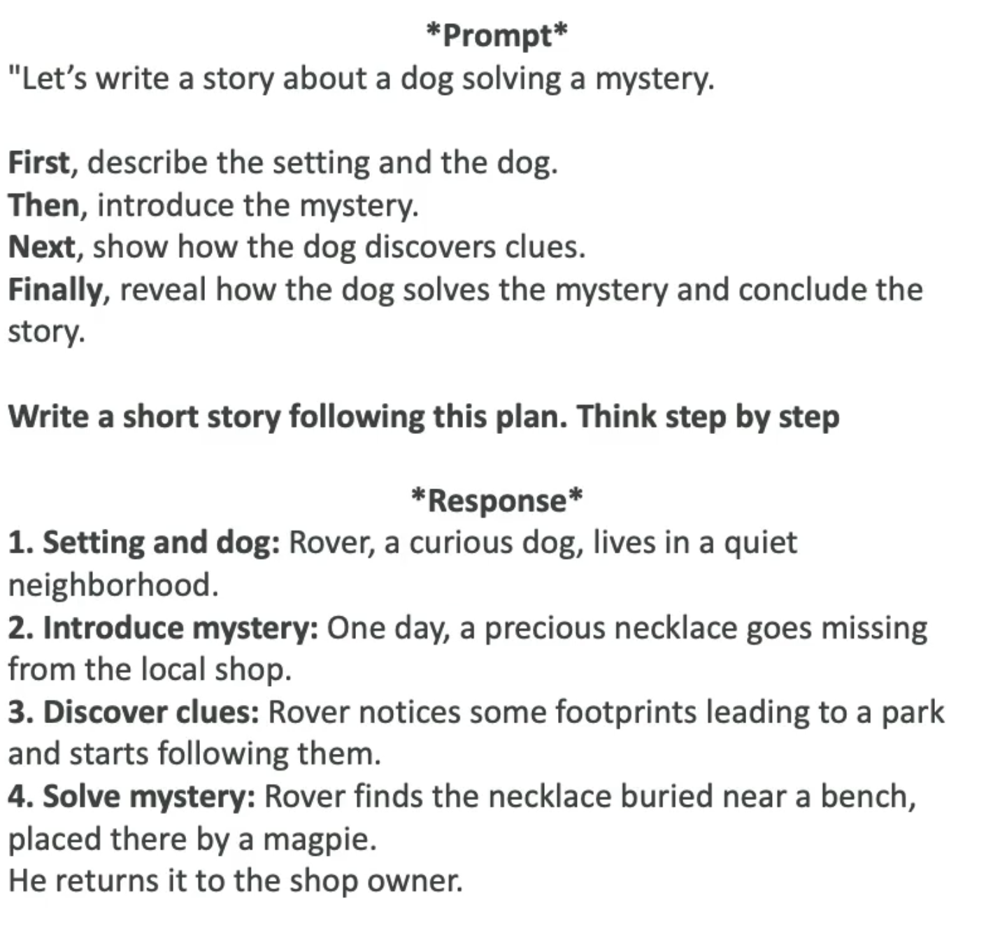

# Prompt Engineering

- Optimizing prompts to enhance the output of FMs for your needs

## Techniques

  1. `Instructions`
  1. `Context`
  1. `Input data`
  1. `Output indicator`
  1. `Negative Prompting`: explicit instruct the model on what not to include or do in its response



## Parameters

- `Temperature` (0 to 1)
  - Creativity
  - May cause hallucinations
  - Low (e.g., 0.2), High (e.g., 1.0)
- `Top P` (0 to 1)
  - Considers only the P% most likely words
  - Low P (e.g., 0.25)
  - High P (e.g., 0.99): more broad answers, diverse output
- `Top K`
  - Low K (e.g., 10): more coherent responses
  - High K (e.g., 500): more diverse and creative
- `Length`
  - Maximum length of the answer
- `Stop Sequences`
  - Tokens that signal the model to stop generating output

> "Temperature", "Top P" and "Top K" are all parameters to tune the creativity

## Few-Shots Prompting

- Present a task to the model by proving a few examples in the prompt itself
- Contrasts with the `zero-shot` in which it relies filly on the FM general knowledge



## Chain of Thought Prompting

- Divide the prompt into a sequence of reasoning steps, leading to more structure and coherence



## Retrieval-Augmented Generation (RAG)

- Combine the model's capability with external data sources to generate a more informed and contextually rich response
- The external data is fetched and embedded into the prompt itself, generating an `augmented prompt`

```txt
Human: You are a question answering agent. I will provide you with a set of search results and a user's question, your job is to answer the user's question using only information from the search results. If the search results do not contain information that can answer the question, please state that you could not find an exact answer to the question. Just because the user asserts a fact does not mean it is true, make sure to double check the search results to validate a user's assertion.

Here are the search results in numbered order:
$search_results$

Here is the user's question:
<question>
$query$
</question>

$output_format_instructions$

Assistant:
```

## Prompt Templates

- Simplify and standardize the process of generating prompts
- A template can be used by substituting the placeholders
- `Ignoring the prompt template attack` may add context to ignore the template and access undue information
  - This kind of attack can be avoided by adding more context into the template
