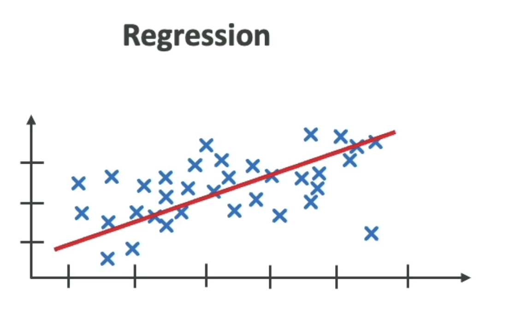
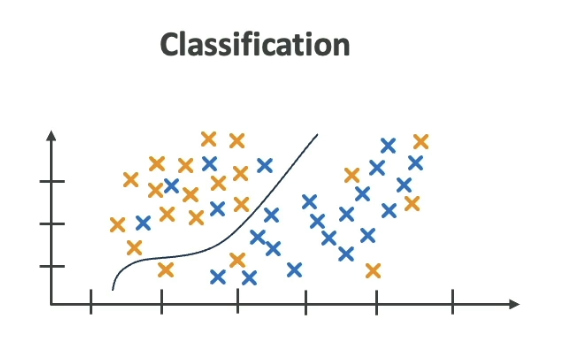

# Machine Learning

- A way to learn from data
- The goal is a set of parameters that can be used to predict another thing
- Makes predictions based on data used to train the model

## Inferencing

- Inferencing is when a model is making preciction on new data

- `Real Time`
  - Favors speed over accuracy
  - E.g., Chatbots

- `Batch`
  - Speed of the result is usually not a concern

## Edge computing

- `Edge devices` are usually device with less computing power that are close to where the data is generated
- `Small Language Models` (SML) are used on edge devices
- `Large Language Models` (LLM) are used on remote powerful servers

## Approaches

### Regression

- Linear regression parameters
  - slope (a) and y-intercept (b)
  - $y = ax + b$

### Classification

### Deep Learning
