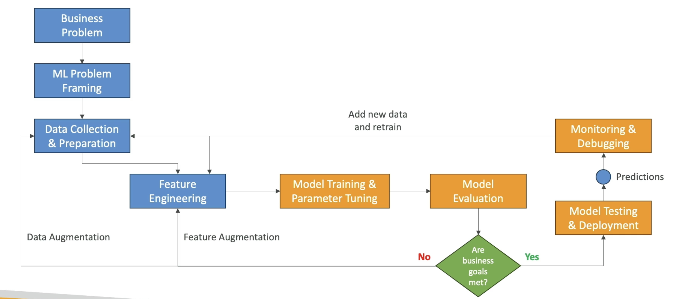

# MLops

- The process on turning raw data into an actual machine learning model
- MLOps applies to the entire lifecycle - from integrating with model generation (software development lifecycle, continuous integration/continuous delivery), orchestration, and deployment, to health, diagnostics, governance, and business metrics

## ML Lifecycle

## VertexAI

- MLops as a service
- Handle this process as a service
- Available on Google Cloud
- Steps
  - Ingest
  - Analyze
  - Transform
  - Train
  - Model
  - Evaluate
  - Deploy
  - Predict

## Hugging Face

- MLops as a service
- Offers also pre-trained open source models to be used as starting point
