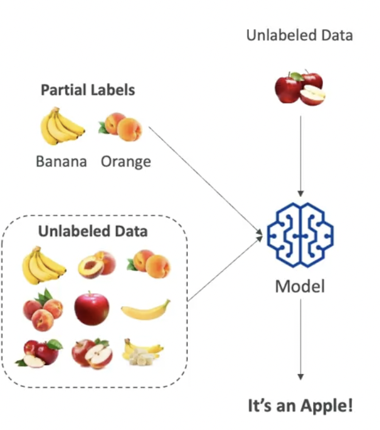

# Training a Model

- To train our model we must have good data
- `Garbage in` => `Garbage out`

## Labeled vs. Unlabeled Data

- **Labeled data** has input features and the corresponding output labels
  - It gives a clue on what the data is about
  - With labeled data you can apply `supervised learning` where the model is trained to map inputs to known outputs

- **Unlabeled data** is just raw data
  - With unlabeled data you can apply `unsupervised learning`, the algorithm itself tries by itself to find pattern in the data and group them together

## Structured vs. Unstructured Data

- **Structured Data** is structured in a predefined format
  - E.g., csv file, time series data

- **Unstructured Data** doesn't follow a specific structure
  - It's usually text-heavy or multimedia content
  - Text data: articles, social media posts, customer reviews
  - Image data: just pixels

## Training Data

- **Training Set**
  - Typically 80% of the dataset
  - Used to the train the model

- **Validation Set**
  - Typically 10% of the dataset
  - Used to tune model hyperparameters and validate performance
  - Tune the settings of the algorithm to make it more efficient

- **Test Set**
  - Typically 10% of the dataset
  - Used the evaluate the final model performance

## Feature Engineering

- It's a preprocessing of the training data to better fit the domain knowledge of the model
- Enhances the performance of the model
- It's applied over structured data or ever unstructured data

- Techniques
  - `Feature extraction`: e.g., derive age from birth date
  - `Feature selection`: e.g., pick only the fields relevant to the model
  - `Feature transform`: e.g., normalize numerical data
  - `TF-IDF`: convert text into numerical features or word embeddings

## Supervised Learning

- Based on labeled data
- Sometimes difficult to implement because labeled data is not easily available
- Examples
  - Linear regression uses labeled data points (x -> y)
  - Classification of images with labeled animals (cats, dogs, etc)
  - Binary classification: email spams

## Unsupervised Learning

- Discover "automatically" inherent patterns, structure or relationships within the input data
- The machine must uncover and create the groups itself

- Techniques
  - `Clustering`
    - Customer segmentation
    - Targeted Marketing
    - Recommender systems
  - `Association Rule Learning`
    - Market basket analysis (products that are bought together)
  - `Anomaly Detection`
    - Fraud (spot outlier transactions)
  - `Dimensionality Reduction`

## Semi-supervised Learning

