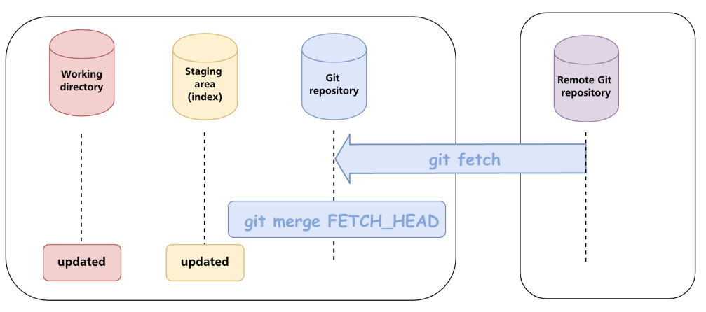

# Git pull

- To perform git pull, there must be `local tracking branch`
- Git pull updates only a `single local currently checked out branch`

- `Steps`
  - The first step is fetch (update git repo), which fetches the new commits from remote. After fetching, `FETCH_HEAD` is created containing hashes of last commits in all tracking branches
  - The second step is merge (update index + working dir), which can be `fast-forward` or `3-way`. The command is `git merge FETCH_HEAD`

