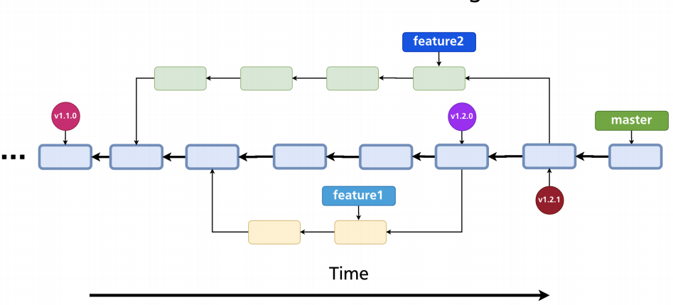

# Tags

- Tags is a `static text pointer` to specific commit
- Tags are used to add `release versions` to the project
- Tags after often named acording to the semantic versioning



## CI/CD and Staging/production environments

- Software is developed according to `CI/CD` principles
- Continuous integration / Continuous delivery (or deployment)
- The division of `staging` and `production` environment are part of CI/CD approach
- `Tests` are set up for every merge

- `Staging` (release branch)

  - Primary for testing
  - Usually for internal use
  - Merging is performed frequently
  - Different feature branches are merged into `release branch`
  - Multiple people may have merge rights

- `Production` (master branch)

  - For stable production service
  - For customers
  - Merging happens each 2 weeks or 1 month
  - Usually only release branch is merged into `master branch`. Exception is for a `hotfix`
  - Only few people have merge rights

## Annotated vs. Lightweight

- `Lightweight`
  - It's stored at `.git/refs/tags` (simply a pointer to the commit)

```shell
git tag v1.0.0
```

- `Annotated`
  - It's stored at `.git/refs/tags`
  - It's also an `object`! It's stored at `.git/objects`. It has its own SHA1 hash
  - Stores tag message, author & date
  - It's recommended to create only annotated tags
  - Tag names are `unique`

```shell
git tag -a v1.0.0 -m "New tag"
```

## Draft new release

- Allows to `create a new version` from a specific commit in Github
