# Solution Architectures

- <https://aws.amazon.com/architecture>
- <https://aws.amazon.com/solutions>

- 5 pillars
  - Cost
  - Performance
  - Reliability
  - Security
  - Operational excellence

## Architecture Use Cases

- Stateless Web App

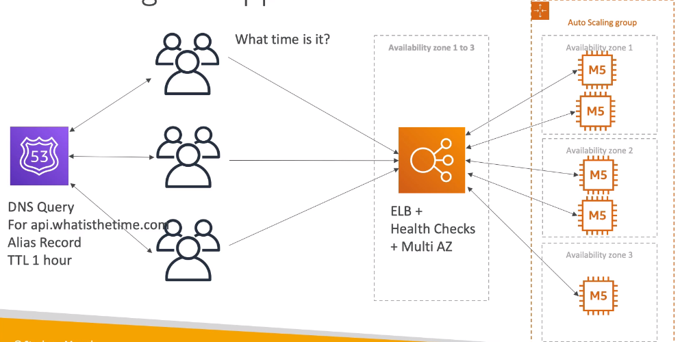

- Stateful (E-commerce)

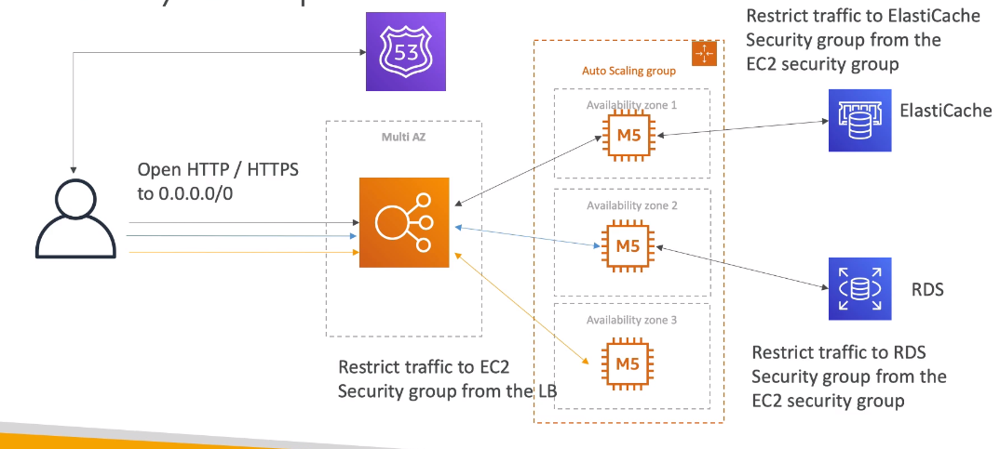

- Stateful (Blog)

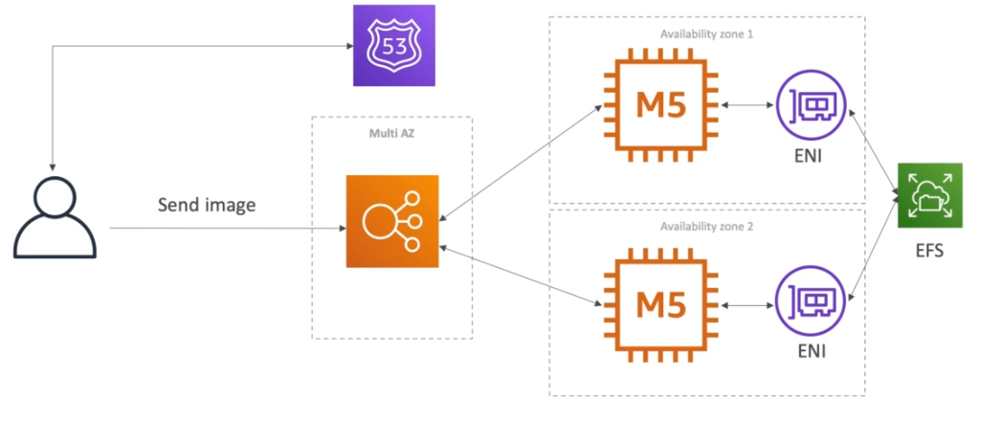

- To Do List Mobile App

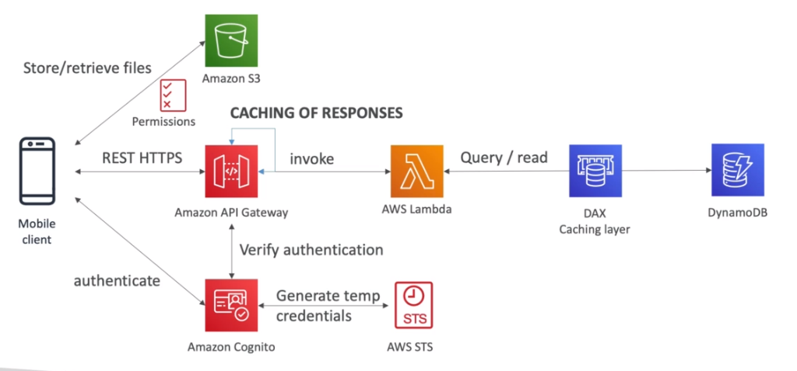

- Serverless Blogs

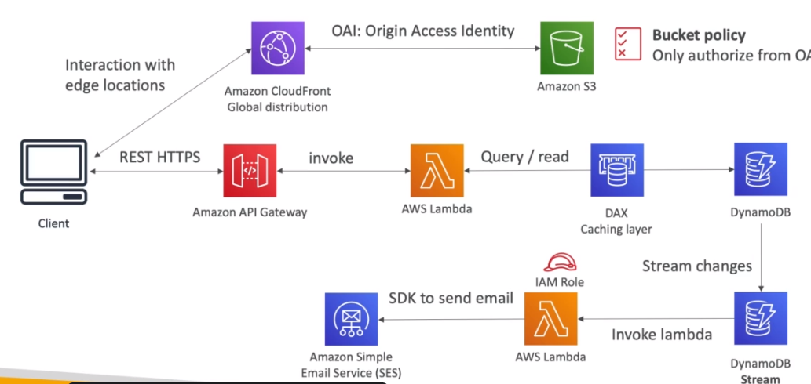

- Microservices

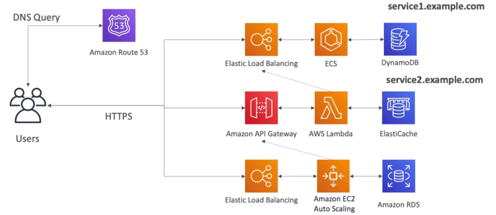

- Distributing paid content

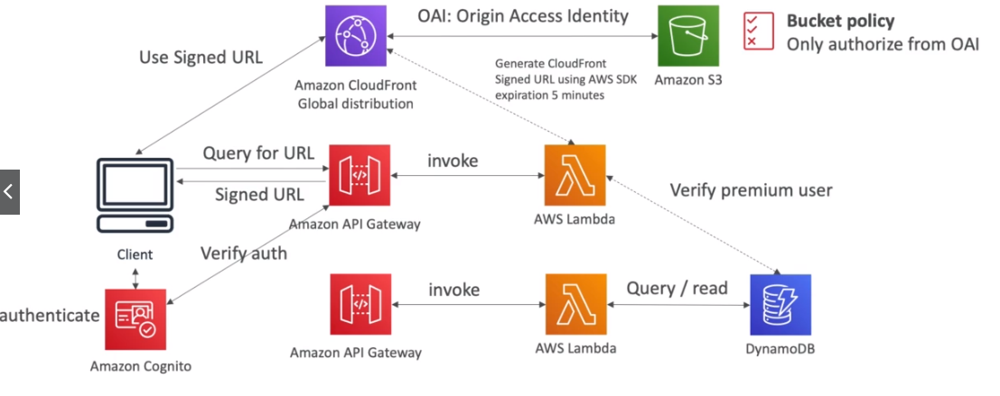

- Software Updates Offloading

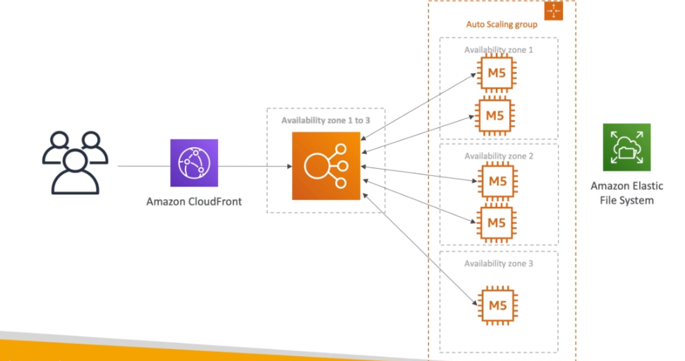

- Big Data Ingestion Pipeline

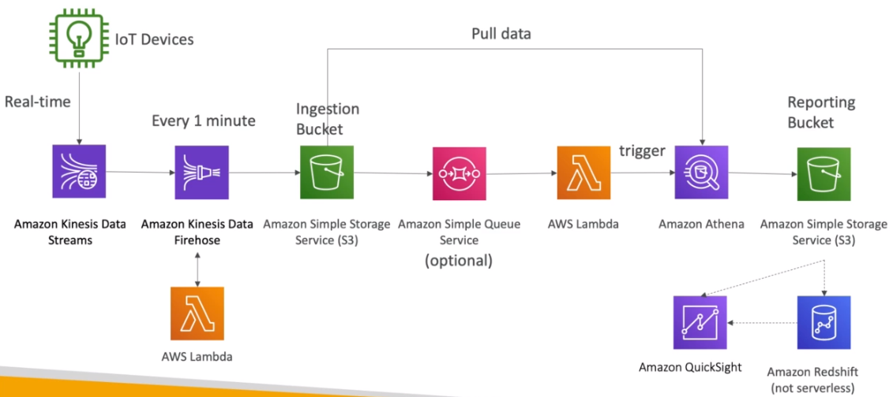

- Lambda, SNS, SQS

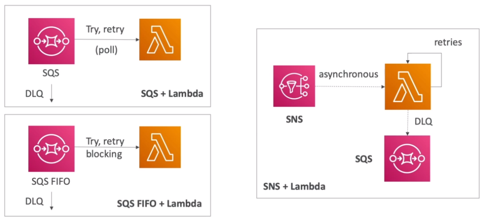

- S3 Events

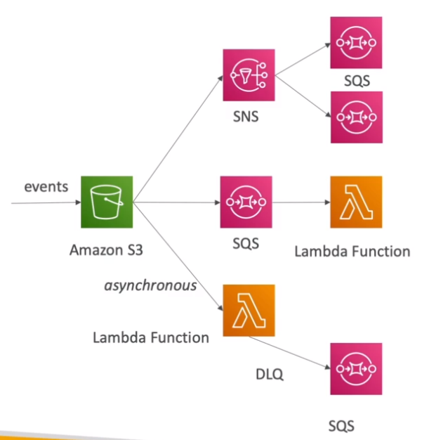

- Caching Strategies

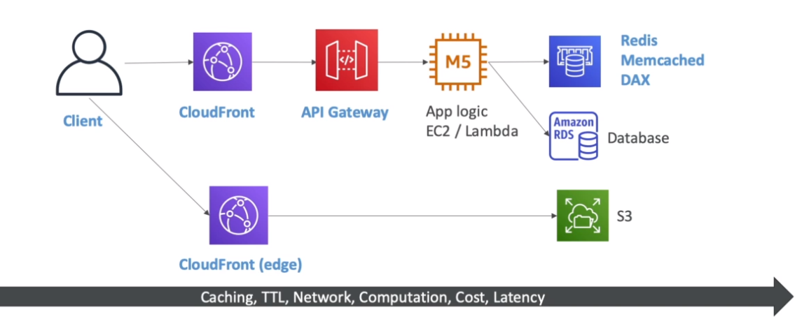

- Network Security

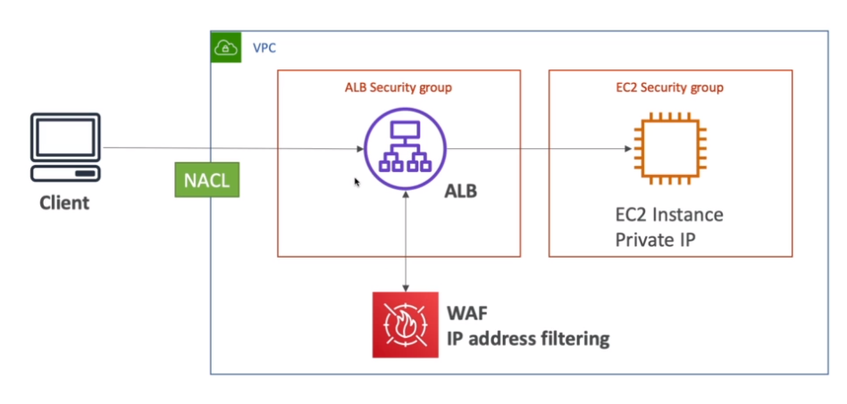
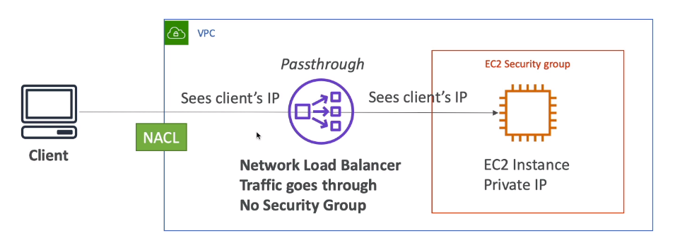
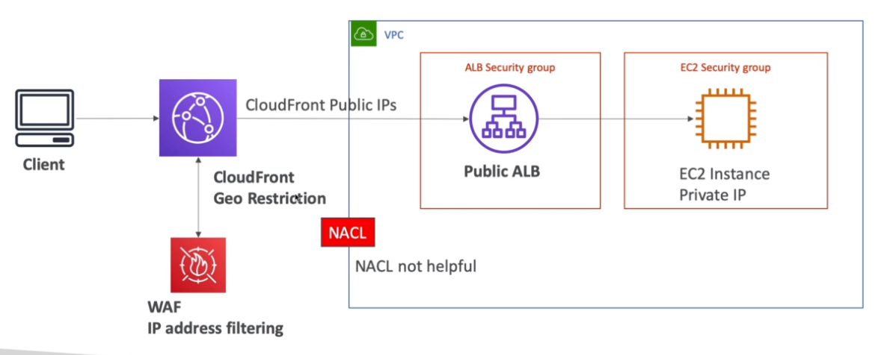

- High Performance Computing (HPC)
