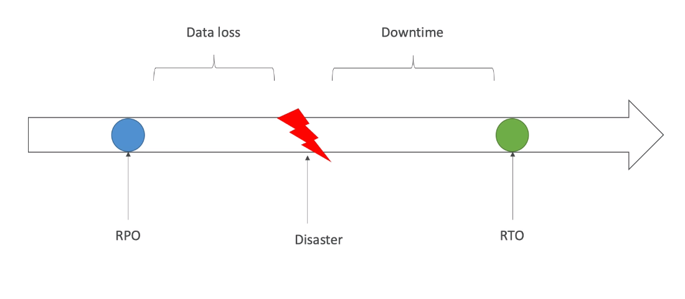
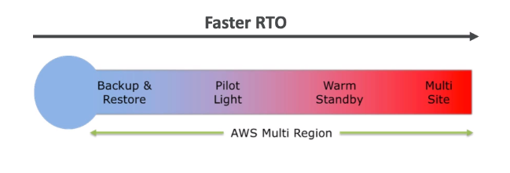
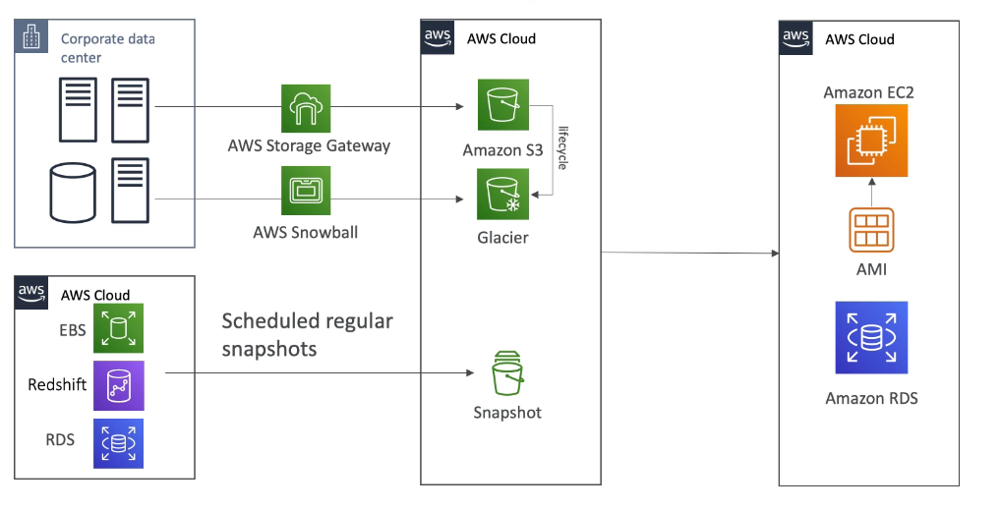
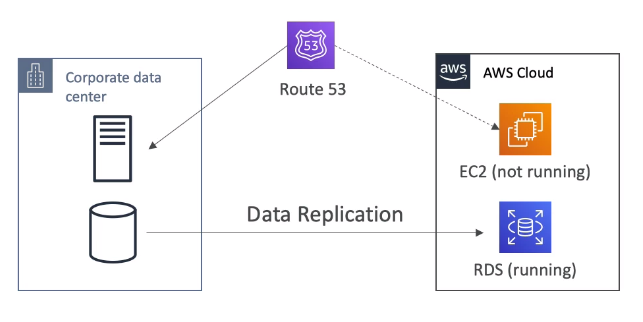
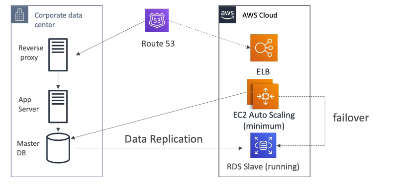
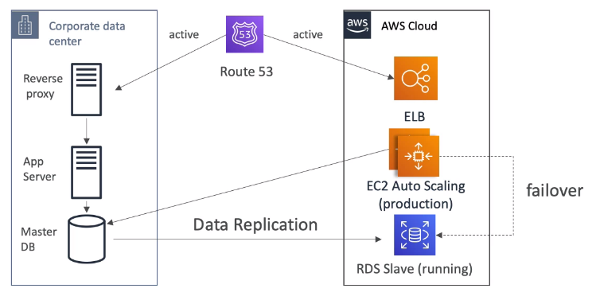

# Disaster Recovery

- `Disaster` is a negative impact on `business continuity` or `finance`
- `Disaster Recovery` (DR) is preparing recover from a disaster

## RPO & RTO

- `Recovery Point Objective` (RPO)
- `Recovery Time Objective` (RTO)

## DR Strategies

1. `Backup & Restore`
1. `Pilot Light`
1. `Warm Standby`
1. `Hot Site / Multi Site`

### Backup & Restore

- High RPO
- High RTO

### Pilot Light

- A small version of the system is always running in the cloud for a fast `failover`
- Faster recovery

### Warm Standby

- Full system is running in the cloud for even faster `failover`

### Multi-Site / Hot-Site

- Full production scale running on the cloud and on-premise

