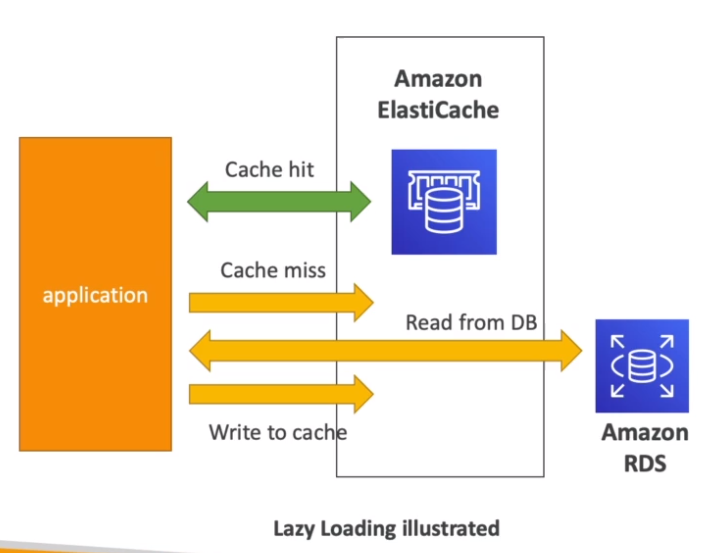
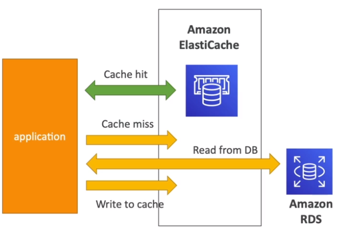
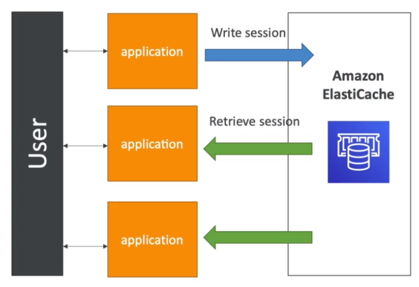
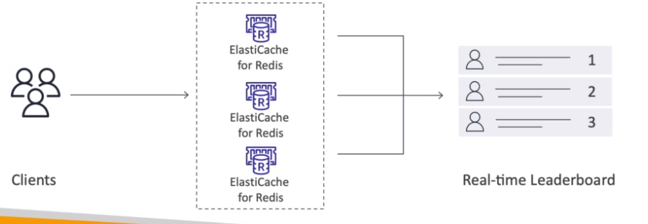

# Caching Use Cases

- `Lazy Loading`: save/update data in cache when reading from db
- `Write Through`: save/update data in cache when writing to db
- `Session Store`: store temporarily using TTL features

## DB Cache

- `Cache hit`: cache is in elasticache
- `Cache miss`: cache is not present in elasticache
- Relieve load from the RDS
- Cache must have an `invalidation strategy` to make sure it has the most recent data

## User Session Store

- Helps the applications become `stateless`
- The app no longer stores the `user session` locally, but saves it in elasticache

## Gaming Leaderboard

- `Redis Sorted Sets` guarantee both uniqueness and ordering
- Each time a new element is added, it's added in the correct order

