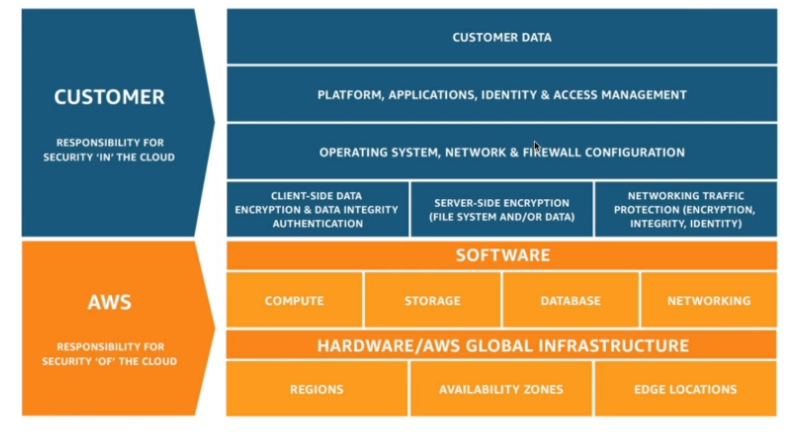

# AWS

- `AWS` was launched for public in 2004
- First services were SQS, S3 and EC2

## Shared Responsibility Model

- `AWS Responsibility`
  - Protect infrastructure
  - Managed services (s3, dynamo, rds, etc)
- `Customer Responsibility`
  - EC2: manage the OS, firewall, network config, IAM
  - Encrypt application data
- `Shared Controls`
  - Patch Management
  - Configuration Management
  - Awareness & Training

