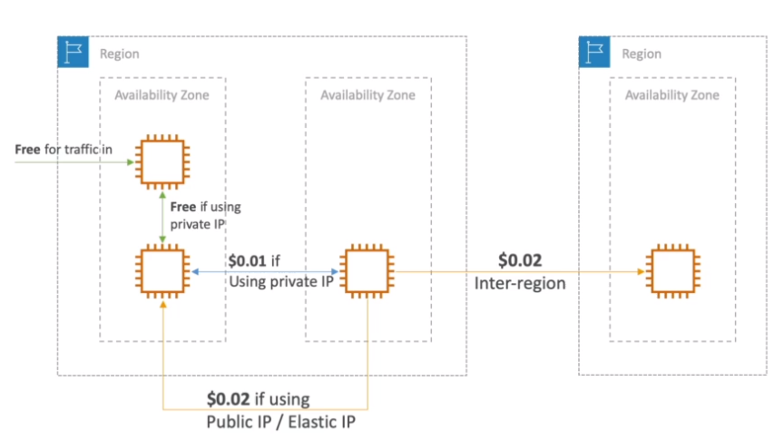
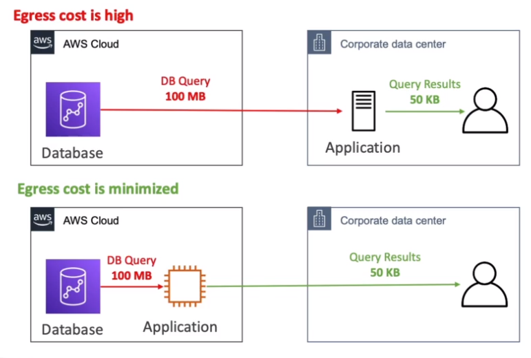
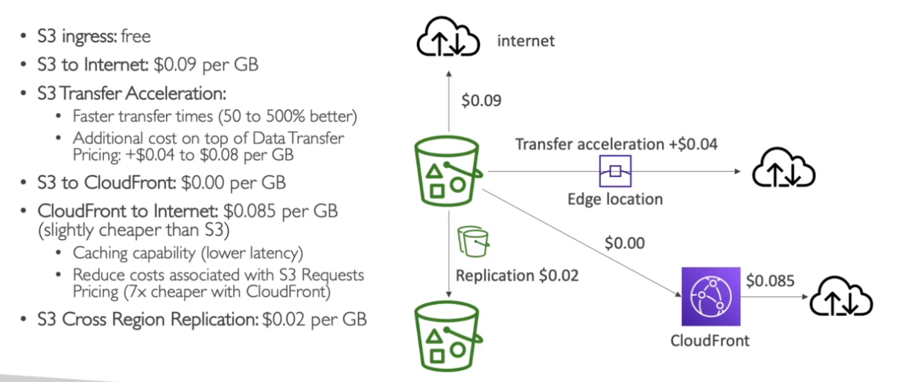
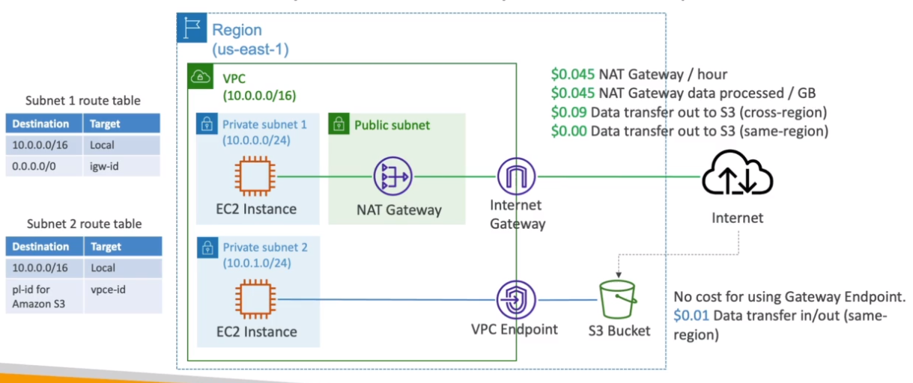

# Pricing

- <https://calculator.aws>

## Compute

- Pay for compute time

## Storage

- Pay for data stored in the Cloud

## Transfer Out

- Pay only for `transfer out` of the cloud

- `Within AZ`: free
- `Across AZ - Private IP`: $0.01 / GB
- `Across AZ - Public IP`: $0.02 / GB
- `Across Regions`: $0.02 / GB

### Ingress vs. Egress Costs

- `Ingress Traffic` (into AWS) is free
- `Egress Traffic` (out of AWS) is paid

- Avoid retrieving large data from AWS
- Try to keep the data as much as possible within AWS

### S3 costs

### NAT Gateway vs. VPC Endpoint

- Prefer VPC Endpoint!

