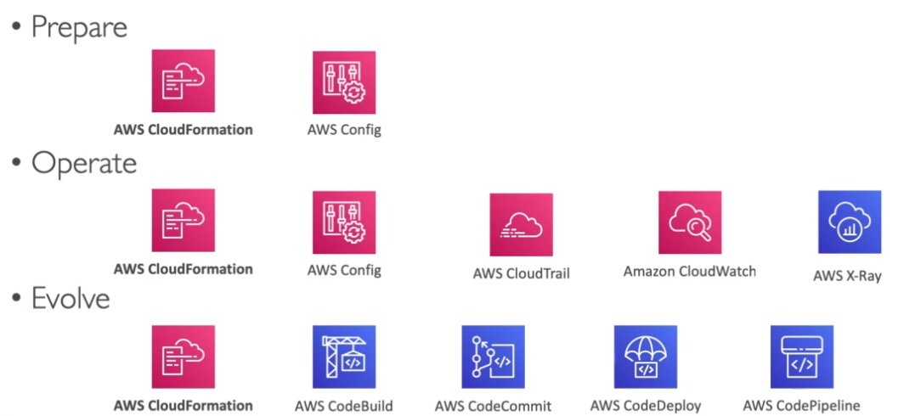
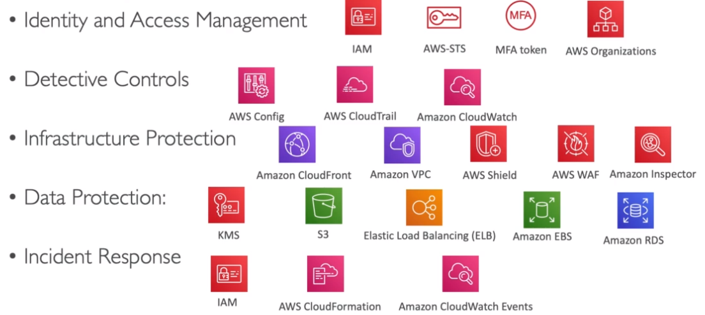
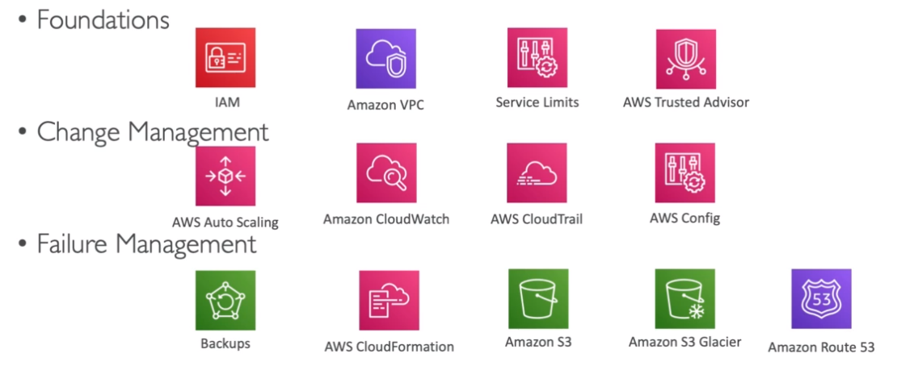
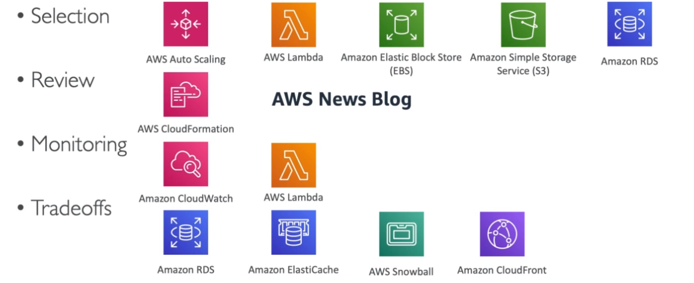
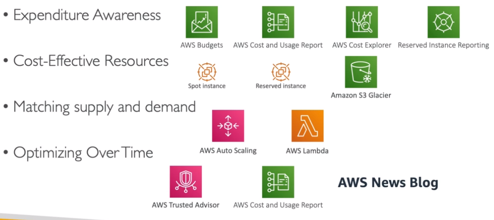
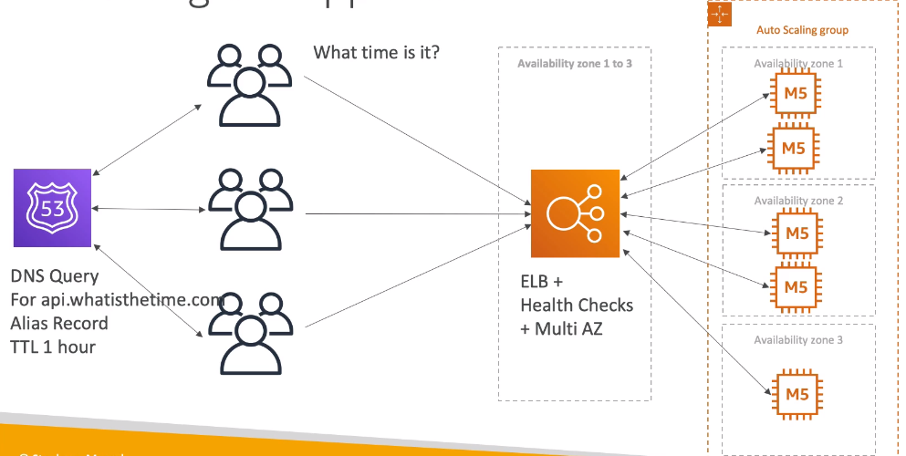
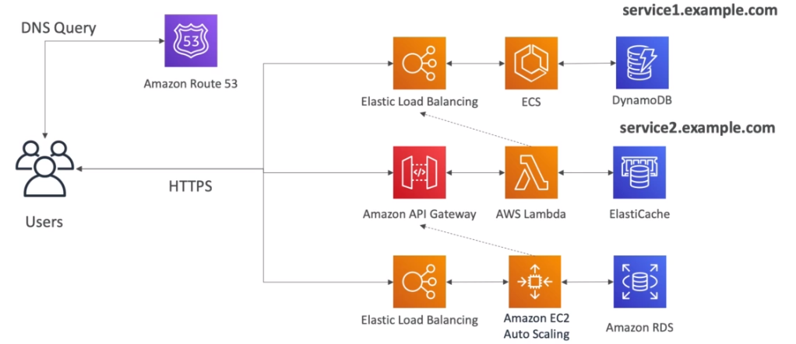
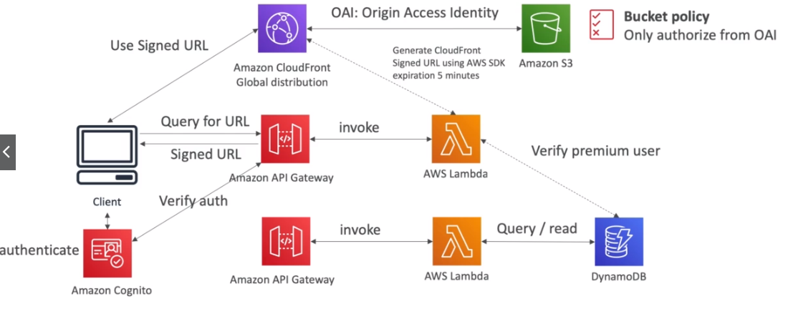
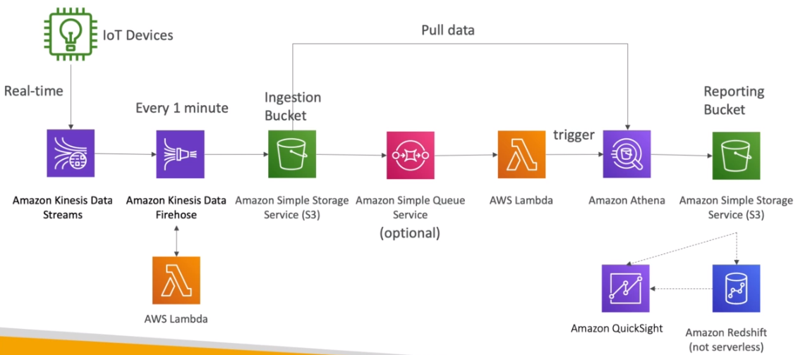

# Well Architected Framework

- <https://aws.amazon.com/architecture/well-architected/>

## 5 Pillars

### Operational Excellence

- Run and monitor systems to deliver business value
- Continuously improve processes and procedures

- **Design Principles**
  - `IaC`
  - `Documentation`
  - `Frequent, small, reversible changes`
  - `Refine operations procedures frequently` and ensure the team is familiar with it
  - `Anticipate failure`
  - `Learn from all operational failures`

### Security

- Protect `information`, `systems` and `assets` while delivering business value
- `Risk assessments` and `mitigation strategies`

- **Design Principles**
  - `Implement a strong identity foundation`: centralize privileges and reduce long-term credentials - Principle of least privilege
  - `Enable traceability`: integrate logs and metrics with systems
  - `Apply security at all layers`: edge network, vpc, subnet, lb, OS, app
  - `Automate security best practices`
  - `Protect data in transit and at rest`
  - `Keep people away from data`
  - `Prepare for security events`: increase speed for detection, investigation and recovery

### Reliability

- System `recover` from infrastructure or service disruptions
- `Dynamically scale` to meet demand and `mitigate disruptions`

- **Design Principles**
  - `Test recovery procedures`: simulate different failures to recreate scenarios
  - `Automatically recover from failure`: anticipate and remediate failures
  - `Scale horizontally to aggregate system availability`
  - `Stop guessing capacity`: use autoscaling
  - `Manage change in automation`: use automation to make infrastructure

### Performance Efficiency

- Use computing resource efficiently
- Maintain that efficiency as demand changes

- **Design Principles**
  - `Democratize advanced technologies`
  - `Go global in minutes`
  - `Use serverless architectures`
  - `Experiment more often`
  - `Mechanical sympathy`: be aware of all AWS services

### Cost Optimization

- Deliver business value at the `lowest price`

- **Design Principles**
  - `Adopt a consumption mode`: pay only for what you use
  - `Measure overall efficiency`: use cloudwatch
  - `Stop spending money on data center operations`: move to cloud and stop worrying about infrastructure
  - `Analyze and attribute expensitures`: use tags to track cost of each application
  - `Use managed and application level services to reduce cost of ownership`: prefer serverless

## Architecture Use Cases

### Stateless Web App

### Stateful (E-commerce)

### Stateful (Blog)

### To Do List Mobile App

### Serverless Blogs

### Microservices

### Distributing paid content

### Software Updates Offloading

### Big Data Ingestion Pipeline

### Lambda, SNS, SQS

### S3 Events

### Caching Strategies

### Network Security

### High Performance Computing (HPC)
