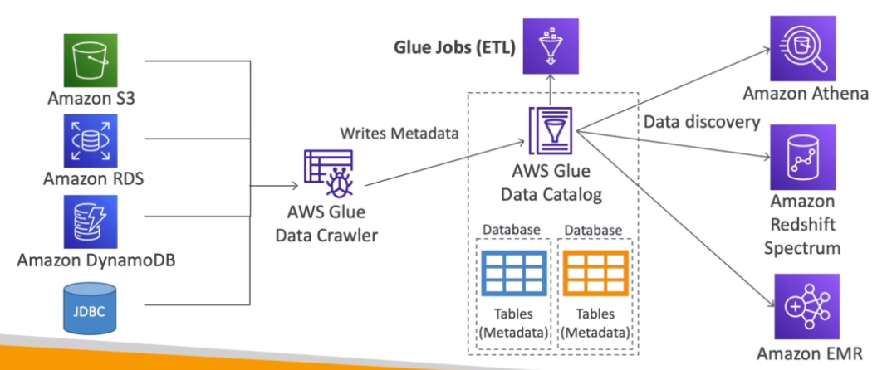

# AWS::Glue::Crawler

- `Glue Data Catalog` stores the metadata about all databases
- It's extracted by `AWS Glue Data Crawler` and written to the catalog



## Properties

- <https://docs.aws.amazon.com/AWSCloudFormation/latest/UserGuide/aws-resource-glue-crawler.html>

```yaml
Type: AWS::Glue::Crawler
Properties:
  Classifiers:
    - String
  Configuration: String
  CrawlerSecurityConfiguration: String
  DatabaseName: String
  Description: String
  LakeFormationConfiguration:
    LakeFormationConfiguration
  Name: String
  RecrawlPolicy:
    RecrawlPolicy
  Role: String
  Schedule:
    Schedule
  SchemaChangePolicy:
    SchemaChangePolicy
  TablePrefix: String
  Tags:
    - Tag
  Targets:
    Targets
```
