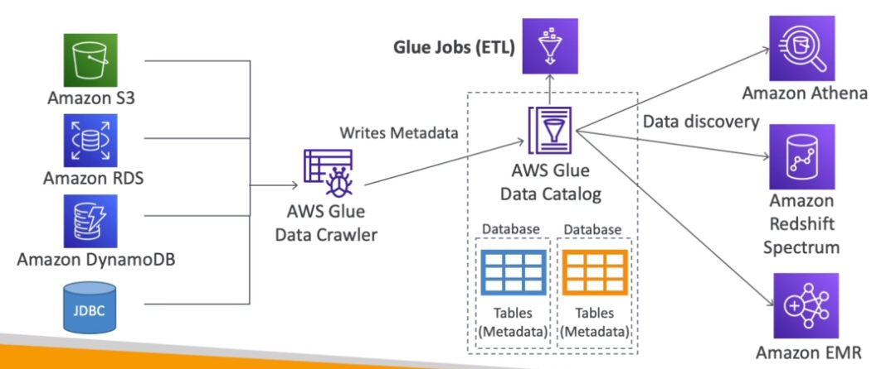

# AWS::Glue::Crawler

- `Glue Data Catalog` stores the metadata about all databases
- It's extracted by `AWS Glue Data Crawler` and written to the catalog

## Properties

- <https://docs.aws.amazon.com/AWSCloudFormation/latest/UserGuide/aws-resource-glue-crawler.html>

