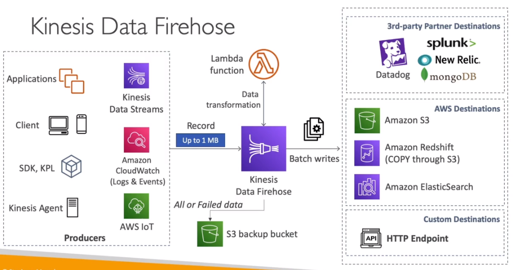

# AWS::KinesisFirehose::DeliveryStream

- Similar to `Kafka Connect`
- Load data streams into storages
  - AWS Destinations (S3, Redshift, ElasticSearch)
  - 3rd-party destinations (datadog, splunk, mongodb, new relic)
  - Custom destinations (http endpoint)
- Supports `aws lambda` for data processing if necessary
- Failed data can be sent to S3 bucket



## Properties

- <https://docs.aws.amazon.com/AWSCloudFormation/latest/UserGuide/aws-resource-kinesisfirehose-deliverystream.html>

```yaml
Type: AWS::KinesisFirehose::DeliveryStream
Properties:
  AmazonOpenSearchServerlessDestinationConfiguration:
    AmazonOpenSearchServerlessDestinationConfiguration
  AmazonopensearchserviceDestinationConfiguration:
    AmazonopensearchserviceDestinationConfiguration
  DeliveryStreamEncryptionConfigurationInput:
    DeliveryStreamEncryptionConfigurationInput
  DeliveryStreamName: String
  DeliveryStreamType: String
  ElasticsearchDestinationConfiguration:
    ElasticsearchDestinationConfiguration
  ExtendedS3DestinationConfiguration:
    ExtendedS3DestinationConfiguration
  HttpEndpointDestinationConfiguration:
    HttpEndpointDestinationConfiguration
  IcebergDestinationConfiguration:
    IcebergDestinationConfiguration
  KinesisStreamSourceConfiguration:
    KinesisStreamSourceConfiguration
  MSKSourceConfiguration:
    MSKSourceConfiguration
  RedshiftDestinationConfiguration:
    RedshiftDestinationConfiguration
  S3DestinationConfiguration:
    S3DestinationConfiguration
  SnowflakeDestinationConfiguration:
    SnowflakeDestinationConfiguration
  SplunkDestinationConfiguration:
    SplunkDestinationConfiguration
  Tags:
    - Tag
```
