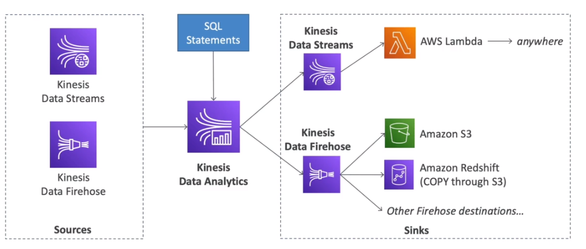

# AWS::KinesisAnalyticsV2::Application

- Similar to `kSQL`
- Analyze data streams with `SQL` or `Flink`
- Use cases
  - Time-series analytics
  - Real-time dashboards
  - Real-time metrics

## Properties

- <https://docs.aws.amazon.com/AWSCloudFormation/latest/UserGuide/aws-resource-kinesisanalyticsv2-application.html>

