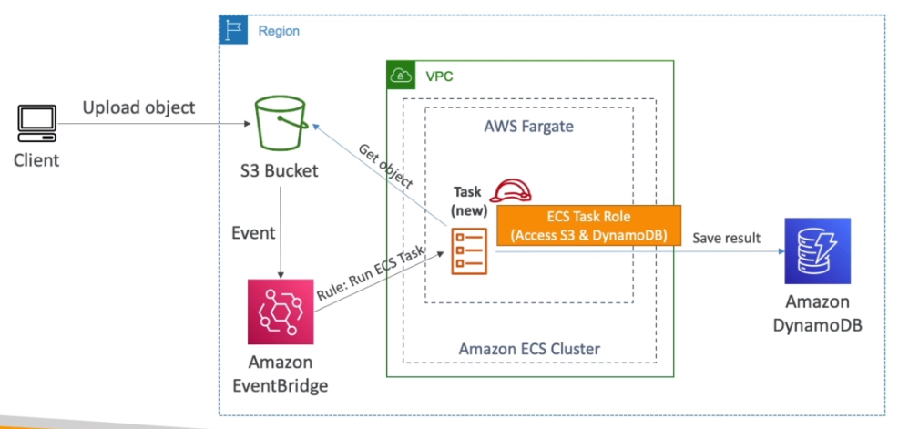

# AWS::Events::EventBus

- Listen for event and perform actions based on them
  - E.g., Create Object in S3 invokes a ECS Task



- Events are sent to the **buses**

  - `Default bus`: events generated by AWS services
  - `Partner event bus`: events generated by 3rd party applications (E.g., datadog, zendesk, etc)
  - `Custom event bus`: events generated by your own applications

- **Schema Registry**
  - Analyze the events in the bus and `infer` its `schema`
  - `Schema Registry` generates code for the application so that it knows how to structure the event before sending
  - Schemas can be versioned

## Properties

- <https://docs.aws.amazon.com/AWSCloudFormation/latest/UserGuide/aws-resource-events-eventbus.html>

```yaml
Type: AWS::Events::EventBus
Properties:
  DeadLetterConfig:
    DeadLetterConfig
  Description: String
  EventSourceName: String
  KmsKeyIdentifier: String
  Name: String
  Policy: Json
  Tags:
    - Tag
```
