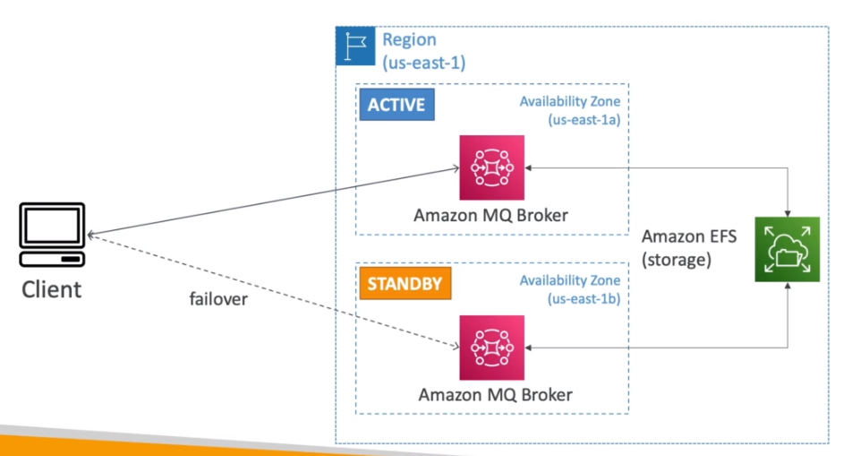

# AWS::AmazonMQ::Broker

- Managed `Apache Active MQ`
- Doesn't scale as much as SQS/SNS

- The application can use standard open protocols
  - MQTT
  - AMQP
  - STOMP
  - Openwire
  - WSS

## High Availability

## Properties

- <https://docs.aws.amazon.com/AWSCloudFormation/latest/UserGuide/aws-resource-amazonmq-broker.html>

