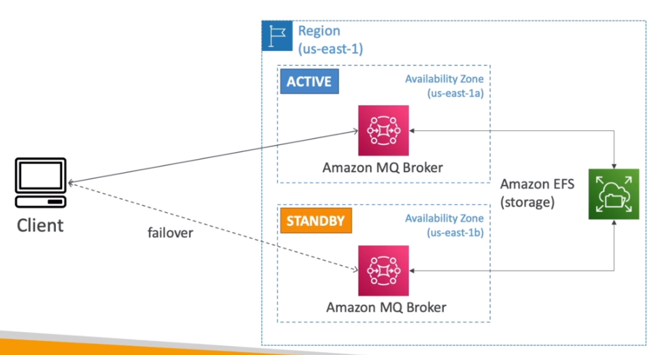

# AWS::AmazonMQ::Broker

- Managed `Apache Active MQ`
- Doesn't scale as much as SQS/SNS

- The application can use standard open protocols
  - MQTT
  - AMQP
  - STOMP
  - Openwire
  - WSS

## High Availability



## Properties

- <https://docs.aws.amazon.com/AWSCloudFormation/latest/UserGuide/aws-resource-amazonmq-broker.html>

```yaml
Type: AWS::AmazonMQ::Broker
Properties:
  AuthenticationStrategy: String
  AutoMinorVersionUpgrade: Boolean
  BrokerName: String
  Configuration:
    ConfigurationId
  DataReplicationMode: String
  DataReplicationPrimaryBrokerArn: String
  DeploymentMode: String
  EncryptionOptions:
    EncryptionOptions
  EngineType: String
  EngineVersion: String
  HostInstanceType: String
  LdapServerMetadata:
    LdapServerMetadata
  Logs:
    LogList
  MaintenanceWindowStartTime:
    MaintenanceWindow
  PubliclyAccessible: Boolean
  SecurityGroups:
    - String
  StorageType: String
  SubnetIds:
    - String
  Tags:
    - TagsEntry
  Users:
    - User
```
