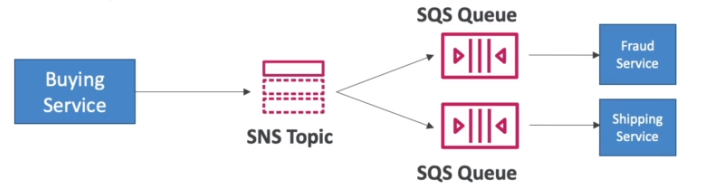
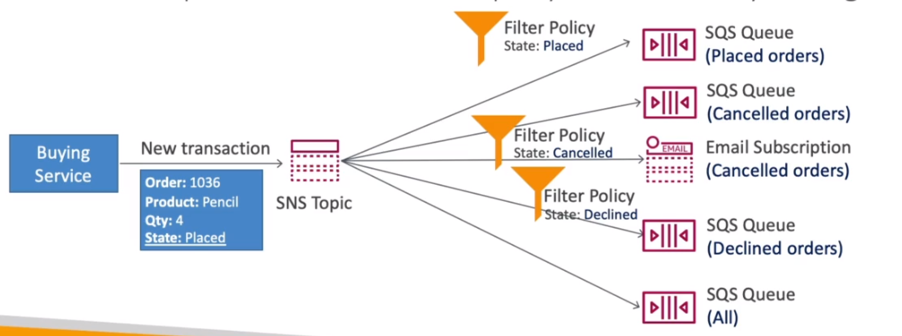

# AWS::SNS::Topic

- `Pub/Sub` model
- It's useful when you have many receivers for a message
- SNS `integrates` with many AWS services (e.g., CloudWatch)

- APIs
  - `TopicPublish`: create topic, create subscription, publish to a topic
  - `DirectPublish`: for mobile apps

## Fan Out Pattern

- Publish once to SNS, Receive in all SQS subscribers
- This way, the clients can that the advantages for SQS
  - `Delayed processing`
  - `Retries`
  - `Fifo`
  - `Filtering`




## Properties

- <https://docs.aws.amazon.com/AWSCloudFormation/latest/UserGuide/aws-resource-sns-topic.html>

```yaml
Type: AWS::SNS::Topic
Properties:
  ArchivePolicy: Json
  ContentBasedDeduplication: Boolean
  DataProtectionPolicy: Json
  DeliveryStatusLogging:
    - LoggingConfig
  DisplayName: String
  FifoTopic: Boolean
  KmsMasterKeyId: String
  SignatureVersion: String
  Subscription:
    - Subscription
  Tags:
    - Tag
  TopicName: String
  TracingConfig: String
```

### FifoTopic

- `SQS FIFO` stores the messages in the exact order they take place
