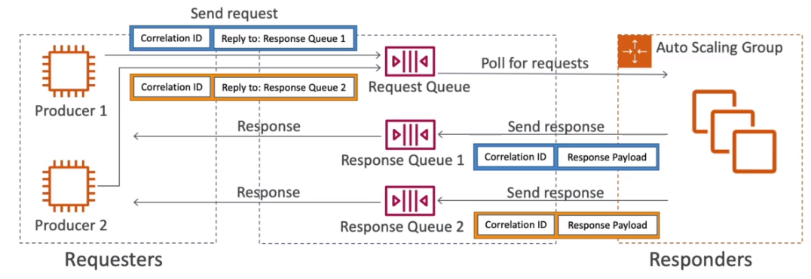

# AWS::SQS::Queue

- SQS uses the principle "one message, one consumer". Therefore you cannot broadcast a message to multiple consumers (for that use SNS)
- Right after each message is consumed and properly handled, it is deleted from the queue

## Producers

- `Unlimited throughput`
- `Unlimited number of messages` in queue
- Can have `out of order messages` (best effort ordering) - except on FIFO
- `SendMessage API` is used to send messages

## Consumers

- Poll messages (can receive up to 10 messages at a time)
- Applications delete (pop) via `DeleteMessage API`
- `At least once delivery` (can duplicate processing)

## Request-Response Systems

- Set a `new queue` which will be used to receive the response of the system that processed the original messages
- A `correlationId` is used to identify the message throughout the flow
- The implement the `reply-to` pattern automatically, the `SQS Temporary Queue Client` (java client) is used



## Properties

- <https://docs.aws.amazon.com/AWSCloudFormation/latest/UserGuide/aws-resource-sqs-queue.html>

```yaml
Type: AWS::SQS::Queue
Properties:
  ContentBasedDeduplication: Boolean
  DeduplicationScope: String
  DelaySeconds: Integer
  FifoQueue: Boolean
  FifoThroughputLimit: String
  KmsDataKeyReusePeriodSeconds: Integer
  KmsMasterKeyId: String
  MaximumMessageSize: Integer
  MessageRetentionPeriod: Integer
  QueueName: String
  ReceiveMessageWaitTimeSeconds: Integer
  RedriveAllowPolicy: Json
  RedrivePolicy: Json
  SqsManagedSseEnabled: Boolean
  Tags:
    - Tag
  VisibilityTimeout: Integer
```

### DelaySeconds

- Only make the message available to be polled after some time (up to 15min). Default to immediate (0s)
- Can be manually overridden by the producer (`DelaySeconds`)
- If only one needs to be postponed, use `message timers`

### FifoQueue

- Ordering preserved, `exactly once` delivery
- FIFO queues ends with `.fifo` suffix
- Guarantee the consume of message in the arrival order
- `Limited throughput`: 300 msg/s (without batching), 3000msg/s (with batching)
- `Exactly-once` send capability
- In FIFO, messages have a `group id` and a `deduplication id`
  - The messages within a group id will be ordered
  - 1 group can only be read by 1 consumer at a time
- In FIFO, if a message does not proccess, the whole queue is blocked

### KmsMasterKeyId

- In-flight encryption with HTTPS
- At-rest encryption with KMS keys
- Client-side encryption

### MaximumMessageSize

- Max `256KB per message`

### MessageRetentionPeriod

- Default retention is `4 days` (max 14 days)

### RedrivePolicy

- Allows redriving the message into a **Dead Letter Queue** (DLQ) when it reaches the `MaximumReceives`
- A DLQ is another queue which will hold messages that could not be processed. Set the name of the DLQ to the same name of your main queue + the suffix `DLQ`
- `MaximumReceives` is how many times a message will fail to process before being redriven to a `dlq`
- SQS itself sends the message to DLQ, it's not a responsibility of the client to produce to DLQ
- Good to set the retention of dlq to `14 days`
- There is no built-in way to send back a message from DLQ to the main queue. This should be done manually

```yaml
AWSTemplateFormatVersion: '2010-09-09'
Resources:
  MyQueueDLQ:
    Type: AWS::SQS::Queue
    Properties:
      QueueName: MyQueueDLQ
      MessageRetentionPeriod: 1209600  # 14 days (in seconds)
  MyQueue:
    Type: AWS::SQS::Queue
    Properties:
      QueueName: MyQueue
      RedrivePolicy:
        deadLetterTargetArn: !GetAtt MyQueueDLQ.Arn
        maxReceiveCount: 5  # Number of times a message can be received before being moved to the DLQ
      MessageRetentionPeriod: 345600  # 4 days (in seconds)
      VisibilityTimeout: 30  # Time to wait before processing a message again after receiving it
```

### VisibilityTimeout

- After a message is polled by a consumer, it becomes `invisible` to other consumers
- Defaults to `30s`. During this period the consumer has to process and delete the message, otherwise it will be available for other consumers
- If a consumer needs more time to process it, the visibility can be changed on the fly with `ChangeMessageVisibility API`

- A message that reaches the visibility timeout without being "commited" as processed will count up as a "try". If it reaches the `MaximumReceives` the message will then be redirected to a DLQ
