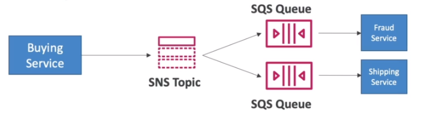
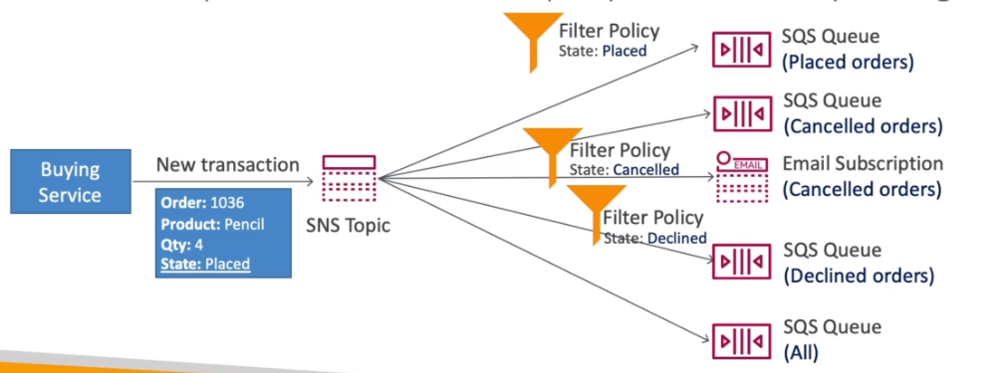

# AWS::SNS::Topic

- `Pub/Sub` model
- It's useful when you have many receivers for a message
- SNS `integrates` with many AWS services (e.g., CloudWatch)

- APIs
  - `TopicPublish`: create topic, create subscription, publish to a topic
  - `DirectPublish`: for mobile apps

```yaml
Type: AWS::SNS::Topic
Properties:
  ContentBasedDeduplication: Boolean
  DisplayName: String
  FifoTopic: Boolean
  KmsMasterKeyId: String
  Subscription:
    - Subscription
  Tags:
    - Tag
  TopicName: String
```

- **Fan Out Pattern**

  - Publish once to SNS, Receive in all SQS subscribers
  - This way, the clients can that the advantages for SQS
    - `Delayed processing`
    - `Retries`
    - `Fifo`
    - `Filtering`

  
  

- **SQS FIFO**
  - Store the messages in the exact order they take place
