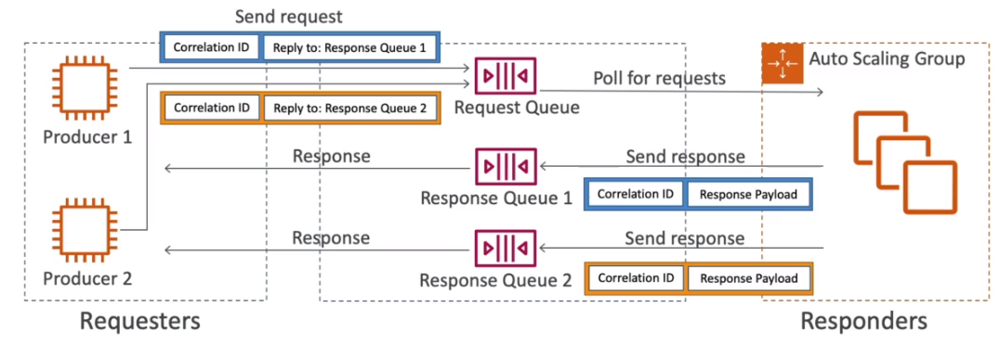

# AWS::SQS::Queue

- Queue model
- Used to `decouple` applications

```yaml
Type: AWS::SQS::Queue
Properties:
  ContentBasedDeduplication: Boolean
  DeduplicationScope: String
  DelaySeconds: Integer
  FifoQueue: Boolean
  FifoThroughputLimit: String
  KmsDataKeyReusePeriodSeconds: Integer
  KmsMasterKeyId: String
  MaximumMessageSize: Integer
  MessageRetentionPeriod: Integer
  QueueName: String
  ReceiveMessageWaitTimeSeconds: Integer
  RedriveAllowPolicy: Json
  RedrivePolicy: Json
  Tags:
    - Tag
  VisibilityTimeout: Integer
```

- **Producers**

  - `Unlimited throughput`
  - `Unlimited number of messages` in queue
  - Can have `out of order messages` (best effort ordering) - except on fifo
  - `SendMessage API` is used to send messages

- **Consumers**

  - Poll messages (can receive up to 10 messages at a time)
  - Applications delete (pop) via`DeleteMessage API`
  - `At least once delivery` (can duplicate processing)

- **Request-Response Systems**

  - Set a `new queue` which will be used to receive the response of the system that processed the original messages
  - A `correlationId` is used to identify the message throughout the flow
  - The implement the `reply-to` pattern automatically, the `SQS Temporary Queue Client` (java client) is used

  

## DelaySeconds

- Only make the message available to be polled after some time (up to 15min). Default to immediate (0s)
- Can be manually overridden by the producer (`DelaySeconds`)
- If only one needs to be postponed, use `message timers`

## FifoQueue

- Ordering preserved, `exactly once` delivery
- FIFO queues ends with `.fifo` suffix
- Guarantee the consume of message in the arrival order
- `Limited throughput`: 300 msg/s (without batching), 3000msg/s (with batching)
- `Exactly-once` send capability
- In FIFO, messages have a `group id` and a `deduplication id`
  - The messages within a group id will be ordered
  - 1 group can only be read by 1 consumer at a time
- In FIFO, if a message does not proccess, the whole queue is blocked

## KmsMasterKeyId

- In-flight encryption with HTTPS
- At-rest encryption with KMS keys
- Client-side encryption

## MaximumMessageSize

- Max `256KB per message`

## MessageRetentionPeriod

- Default retention is `4 days` (max 14 days)

## RedrivePolicy

- **Dead Letter Queue**
  - `MaximumReceives` threshold how many times a message wil fail to process before going to a `dlq` using
  - Useful for debugging
  - Good to set the retention of dlq to `14 days`

## VisibilityTimeout

- After a message is polled by a consumer, it becomes `invisible` to other consumers
- Defaults to `30s`. During this period the consumer has to process and delete the message, otherwise it will be available for other consumers
- If a consumer needs more time to process it, the visibility can be changed on the fly with `ChangeMessageVisibility API`
