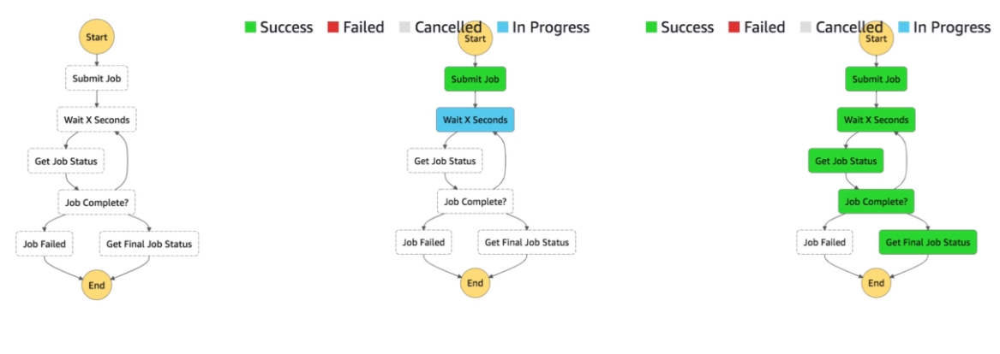

# AWS::StepFunctions::StateMachine

- A `low-code visual workflow` to setup lambda function and orchestrate actions between them
- Max 1 year runtime
- All the flow is represented as a JSON `state machine`



- **Features**
  - Sequence
  - Parallel
  - Conditions
  - Timeouts
  - Retries
  - Error handling
  - ...

- **Simple Workflow Service (SWF)** is an alternative to Step Function, which runs on EC2

## Properties

- <https://docs.aws.amazon.com/AWSCloudFormation/latest/UserGuide/aws-resource-stepfunctions-statemachine.html>

```yaml
Type: AWS::StepFunctions::StateMachine
Properties:
  Definition: Json
  DefinitionS3Location:
    S3Location
  DefinitionString:
    String
  DefinitionSubstitutions:
    Key: Value
  EncryptionConfiguration:
    EncryptionConfiguration
  LoggingConfiguration:
    LoggingConfiguration
  RoleArn: String
  StateMachineName: String
  StateMachineType: String
  Tags:
    - TagsEntry
  TracingConfiguration:
    TracingConfiguration
```
