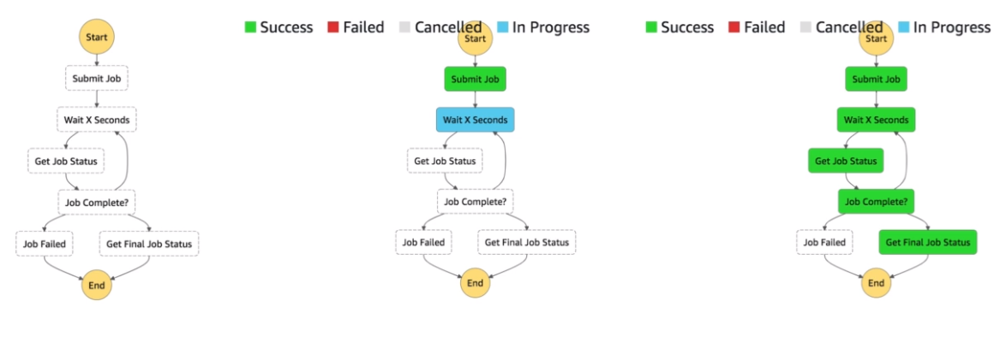

# AWS::StepFunctions::StateMachine

- A `low-code visual workflow` to setup lambda function and orchestrate actions between them
- Max 1 year runtime
- All the flow is represented as a JSON `state machine`

- **Features**

  - Sequence
  - Parallel
  - Conditions
  - Timeouts
  - Retries
  - Error handling
  - ...

- **Simple Workflow Service (SWF)** is an alternative to Step Function, which runs on EC2
