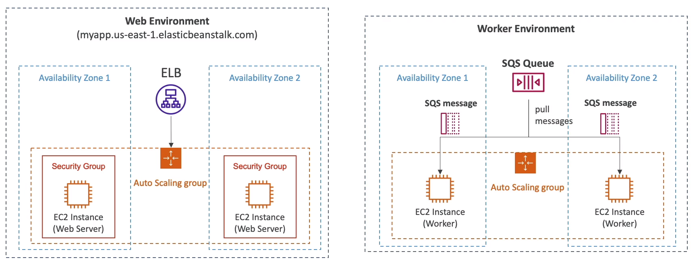

# AWS::ElasticBeanstalk::Environment

- AWS resources running a specific application version
- Supports multiple environments: dev, test, prod, etc

## Properties

- <https://docs.aws.amazon.com/AWSCloudFormation/latest/UserGuide/aws-resource-elasticbeanstalk-environment.html>

### Tier

- `Web Environment`: clients access your server directly
- `Worker Environment`: server is accessed by internal components only. E.g., SQS
