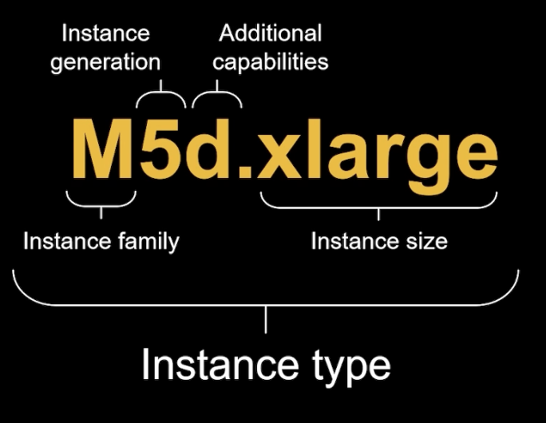

# AWS::EC2::Instance

- `Elastic Compute Cloud` (EC2) is a virtual machine instance

## Lifecycle

- `normal`: On demand instances
- `spot`: Spot instances

## Metadata

- Allows EC2 instances to "learn about themselves"
- The EC2 instances must request the internal IP <http://169.254.169.254/latest/meta-data>
- It returns many info about itself. E.g., mac addresses, SGs, IAM roles, ...

## SSH

- In order to ssh into a running ec2 instance, you need the public ipv4 address and the private key of the ssh key-pair associated with the machine
- Private SSH key must have `400` permission (or yourself as owner of the file on windows)
- `ec2-user` is the default user of EC2 instances
- In order to ssh into an EC2 instance, the EC2 instance needs to have an attached security group (AWS::EC2::SecurityGroup) that allows inbound TCP port 22 traffic from any location (remote access)

```shell
ssh "ec2-user@44.204.164.92" -i "ec2demo.pem"
```

## EC2 Instance Connect

- Alternative way to connect to the VM
- It's achievable under `Connect` on the instances tab
- This prompts a terminal into the machine
- Under the hood it relies on SSH and security group must have 22 inbound port allowed

## Properties

- <https://docs.aws.amazon.com/AWSCloudFormation/latest/UserGuide/aws-resource-ec2-instance.html>

```yaml
Type: AWS::EC2::Instance
Properties:
  AdditionalInfo: String
  Affinity: String
  AvailabilityZone: String
  BlockDeviceMappings:
    - BlockDeviceMapping
  CpuOptions:
    CpuOptions
  CreditSpecification:
    CreditSpecification
  DisableApiTermination: Boolean
  EbsOptimized: Boolean
  ElasticGpuSpecifications:
    - ElasticGpuSpecification
  ElasticInferenceAccelerators:
    - ElasticInferenceAccelerator
  EnclaveOptions:
    EnclaveOptions
  HibernationOptions:
    HibernationOptions
  HostId: String
  HostResourceGroupArn: String
  IamInstanceProfile: String
  ImageId: String
  InstanceInitiatedShutdownBehavior: String
  InstanceType: String
  Ipv6AddressCount: Integer
  Ipv6Addresses:
    - InstanceIpv6Address
  KernelId: String
  KeyName: String
  LaunchTemplate:
    LaunchTemplateSpecification
  LicenseSpecifications:
    - LicenseSpecification
  Monitoring: Boolean
  NetworkInterfaces:
    - NetworkInterface
  PlacementGroupName: String
  PrivateDnsNameOptions:
    PrivateDnsNameOptions
  PrivateIpAddress: String
  PropagateTagsToVolumeOnCreation: Boolean
  RamdiskId: String
  SecurityGroupIds:
    - String
  SecurityGroups:
    - String
  SourceDestCheck: Boolean
  SsmAssociations:
    - SsmAssociation
  SubnetId: String
  Tags:
    - Tag
  Tenancy: String
  UserData: String
  Volumes:
    - Volume
```

### Affinity

- Indicates whether the instance is associated with a dedicated host
- It can be used with a dedicated host (`AWS::EC2::Host`)

### BlockDeviceMappings

- Specifies an `Instance Storage`
- It's a `physical drive` to be attached to your EC2 instance
- Offers a better performed when compared to EBS
- It's `ephemeral`
- It's the fastest speed possible (faster than EBS and EFS)

```json
{
  "BlockDeviceMappings": [
    { "DeviceName": "/dev/sdb", "VirtualName": "ephemeral0" },
    { "DeviceName": "/dev/sdc", "VirtualName": "ephemeral1" },
    { "DeviceName": "/dev/sdd", "VirtualName": "ephemeral2" },
    { "DeviceName": "/dev/sde", "VirtualName": "ephemeral3" }
  ]
}
```

### EnclaveOptions

- Indicates whether the instance is enabled for `AWS Nitro Enclaves`.
- `EC2 Nitro` is the underlying platform for the next generation of EC2 instances: New `virtualization technology`
- Better networking: HPC, IPv6
- Higher speed EBS volume (64k IOPS, 32k on non-nitro)
- Supports `io2 Block Express` volume to achieve maximum IOPS of 256k

### ImageId

- The ID of the AMI. An AMI ID is required to launch an instance and must be specified here or in a launch template.
- The VM is created from an `Amazon Machine Image` (AMI)
- AMIs are based on the `underlying snapshots`
- AMI can only be used inside of its `Region` (but you can copy the AMI to another region and use from there)
- You can launch EC2 instances from
  - `Public AMI`
  - `Own AMI`
  - `Marketplace AMI`
- A custom AMI can be created from a running EC2 instance. A snapshot from the VM is created under the hood
- **AMI Embedded with Bootstrap**
  - `Bootstrap` script can be run at the machine startup
  - This way, every time a ec2 instance spins, it executes the script
  - It's good when the script is dynamic. It's resulting effect changes according to the circunstancies
- **Golden AMI**
  - `Golden AMI` is the image that contains embedded the application with all the dependencies installed beforehand
  - It speeds up the application boot time and improves scaling velocity

### InstanceType

- <https://ec2instances.info>
- `1vCPU`: one thread in a CPU

- **General Purpose** instance class
  - `t`, `m` series
  - E.g., t2.micro (free tier - 750h/month), t2.xlarge, m5.2xlarge
- **Compute Optimized** instance class
  - batch processing, media transcoding, etc
  - `c` series
  - E.g., c5d.4xlarge
- **Memory Optimized** instance class
  - relational databases, cache databases, etc
  - `r`, `x` series
  - E.g., r5.16xlarge
- **Storage Optimized** instance class
  - sequential read/write, distributed filesystem
  - `i`, `d`, `h` series



### Tenancy

- **default**: shared hardware
- **dedicated**: single-tenant hardward
- **host**: isolated server

- You can change the `tenancy` from `host` to `dedicated`
- You can change the `tenancy` from `dedicated` to `host`

### UserData

- Bootstrap script: configure vm at first launch
- E.g., install a web server

```bash
#!/bin/bash
yum update -y
yum install -y httpd # or sudo amazon-linux-extras install nginx1
systemctl start httpd # or nginx
systemctl enable httpd # or nginx
echo "<h1>Hello World from $(hostname -f)</h1>" > /var/www/html/index.html # /usr/share/nginx/html for nginx
```

- The script can be retrieved from <http://169.254.169.254/latest/user-data>
