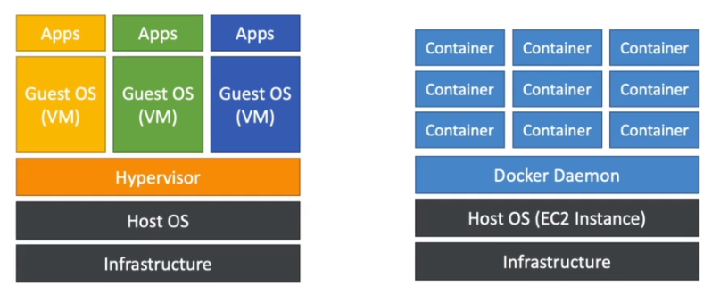
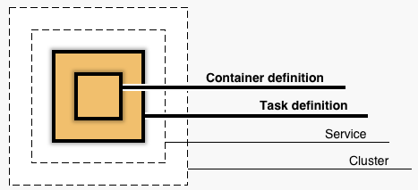
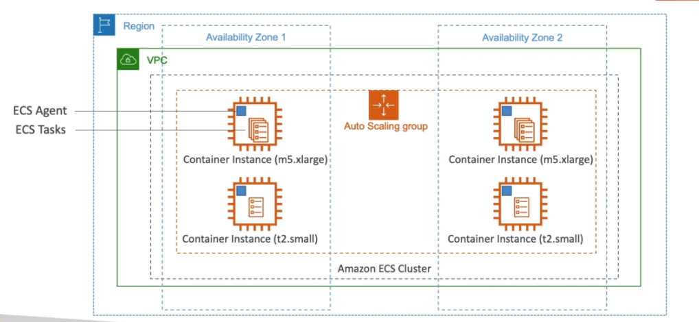
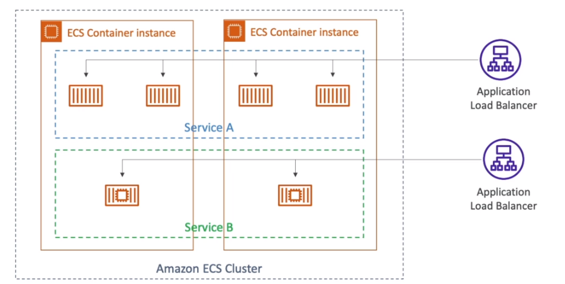
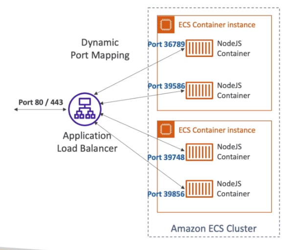
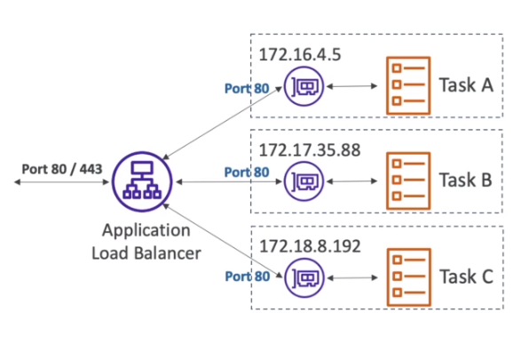

# AWS::ECS::Cluster

- `Container runtime` service
- Container applications run in the OS just as a process
- With ECS you must provision and maintain the underlying EC2 instances
- ECS is basically a scheduler! To decide to which instance the container will be provisioned



- A `ECS Cluster` is a collection of `ECS Container Instances`
- The `services` run in the ECS cluster. Each service is compose of one or more `tasks`
- Services can be exposed by a Load Balancer



- Container: Container
- Task: Pod
- Service: Deployment
- Cluster: Cluster

```yaml
Type: AWS::ECS::Cluster
Properties:
  CapacityProviders:
    - String
  ClusterName: String
  ClusterSettings:
    - ClusterSettings
  Configuration: ClusterConfiguration
  DefaultCapacityProviderStrategy:
    - CapacityProviderStrategyItem
  Tags:
    - Tag
```

- **Scaling**
  - A `CloudWatch` alarm can be set in order to emit events based on the `service metrics`
  - `Autoscaling` can be enabled based on the metrics
  - For EC2 Launch Type, `Scale ECS Capacity Providers` to scale the ec2 instances

## CapacityProviders

- **EC2 Launch Type**

  - An `ECS Agent` runs inside each EC2 instances
  - This agent `registers` the instance to the `ECS Cluster`
  - Registered instances can receive `ECS Tasks`, which are container workloads
  - Charged based on EC2 instances and EBS volumes

  

  

  - In order to forward requests to the applications, dynamic port mapping is used

  

- **Fargate Launch Type**

  - No need the provision the underlying infrastructure. Simpler! Serverless!
  - Each `ECS Task` is associated with a new `ENI` in the `EC2 Cluster` (needs a long range VPC)
  - Charged based on vCPU and memory resources

  - For forwarding traffic, the Load Balancer forwards to each IP (each task has a unique ENI)

  
