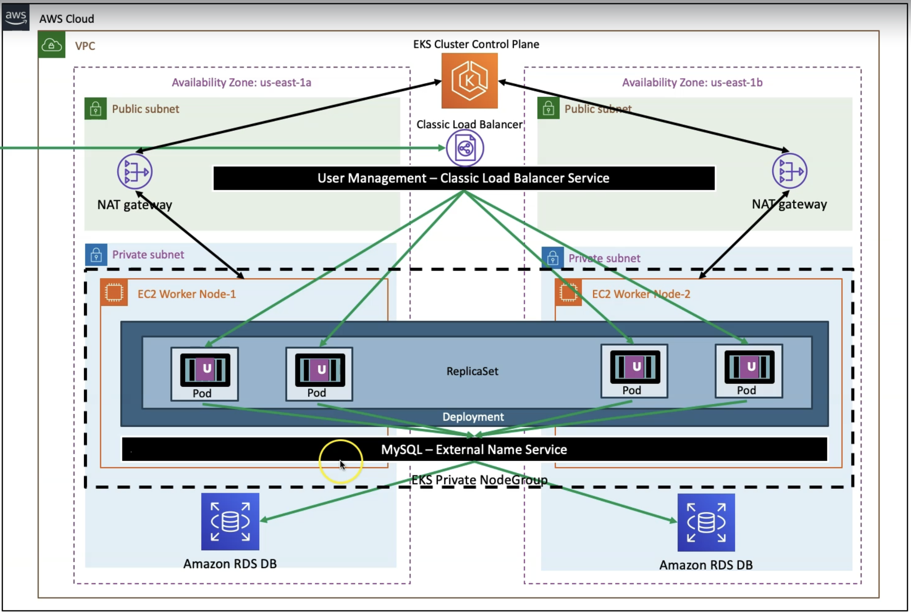

# AWS::EKS::Cluster

- `Elastic Kubernetes Service` is a container orchestration service
- It's an alternative to ECS
- ARN example: `arn:aws:eks:us-east-1:123456789012:cluster/foo`




- EKS Cluster outputs:
  - API server endpoint `https://0123456789ABCDEF0123456789ABCDEF.gr7.us-east-1.eks.amazonaws.com`
  - OpenID Connect provider URL `https://oidc.eks.us-east-1.amazonaws.com/id/0123456789ABCDEF0123456789ABCDEF`

## Control Plane

- Created by the resource AWS::EKS::Cluster (this resource)
- Contains the `master components` (etcd, kube-apiserver, kube-controller, etc)
  - 2 API servers & 3 etc nodes that run across 3 AZs
- It's managed by AWS. The control plane nodes are not shown in `kubectl get node`

- As part of the creation of the cluster a set of network components are created, including a `VPC`
  - Restrict networking traffic between control plane components
  - Control plane components cannot communicate with other aws resources except as authorized via RBAC

## Resources

- Cluster
  - 1 **EKS Cluster** (AWS::EKS::Cluster) (`eksctl-foo-cluster/VPC`)

- Networking
  - 1 **VPC** (AWS::EC2::VPC) is created for the entire cluster
  - 1 per AZ **Public Subnet** (AWS::EC2::Subnet) (`eksctl-foo-cluster/SubnetPublicUSEAST1A`)
    - It's attached to an InternetGateway (to allow traffic to internet) and to a NATGateway (to allow traffic from private subnets)
  - 1 per AZ **Private Subnet** (AWS::EC2::Subnet) (`eksctl-foo-cluster/SubnetPrivateUSEAST1A`)
  - 1 **EIP** (AWS::EC2::EIP)

- Security
  - 1 **SG** (AWS::EC2::SecurityGroup)(ControlPlaneSecurityGroup: `eks-foo-sg-foo-12345678`) (Cluster SG)
    - Attached to the ENI all nodes (masters and workers)
  - 1 **SG** (AWS::EC2::SecurityGroup) (ClusterSharedNodeSecurityGroup: `eksctl-foo-cluster/ControlPlaneSecurityGroup`) (Additional SGs)
    - Attached to the ENI of the master nodes only

- Permissions
  - 1 **IAM Role** (AWS::IAM::Role) (`eksctl-foo-cluster-ServiceRole-abcdefghijkl`)
    - Attached to the EKS Cluster

## Worker Nodes

- **Node Groups** (EC2 Launch Mode)
  - Created by the resource AWS::EKS::Nodegroup
  - Worker nodes baked by EC2 instances

- **Fargate Profiles** (Fargate Mode)
  - Created by the resource AWS::EKS::FargateProfile

- **Self-managed Nodes**
  - Nodes created by you and registered to EKS

- **Karpenter**

## Pricing

- Control Plane
  - `$0.10 / hour`, `$2.40 / day`, `$72 / month`

- Node Groups
  - Depends on the types and number of EC2 instances used
  - E.g., t3.medium: `$30 / month`

## Properties

- <https://docs.aws.amazon.com/AWSCloudFormation/latest/UserGuide/aws-resource-eks-cluster.html>

```yaml
Type: AWS::EKS::Cluster
Properties:
  AccessConfig:
    AccessConfig
  BootstrapSelfManagedAddons: Boolean
  EncryptionConfig:
    - EncryptionConfig
  KubernetesNetworkConfig:
    KubernetesNetworkConfig
  Logging:
    Logging
  Name: String
  OutpostConfig:
    OutpostConfig
  ResourcesVpcConfig:
    ResourcesVpcConfig
  RoleArn: String
  Tags:
    - Tag
  UpgradePolicy:
    UpgradePolicy
  Version: String
  ZonalShiftConfig:
    ZonalShiftConfig
```

### RoleArn

- It's the `Cluster IAM role`
- This role that provides permissions for the `Kubernetes control plane` to make `calls to AWS API operations on your behalf`
- This role is important for the cluster to auto-manage itself. Example: to create more nodes (ec2 instances) when scaling is needed
- The cluster role must be associated with a policy that allow managing several aspects of aws
- ARN example: `arn:aws:iam::123456789012:role/eksctl-foo-cluster-ServiceRole-VBrrsaRBhVBQ`
- It's different from the node group role, which is attached to the worker nodes

- Managed Policies
  - [AmazonEKSClusterPolicy](https://docs.aws.amazon.com/aws-managed-policy/latest/reference/AmazonEKSClusterPolicy.html)
  - [AmazonEKSVPCResourceController](https://docs.aws.amazon.com/aws-managed-policy/latest/reference/AmazonEKSVPCResourceController.html)
