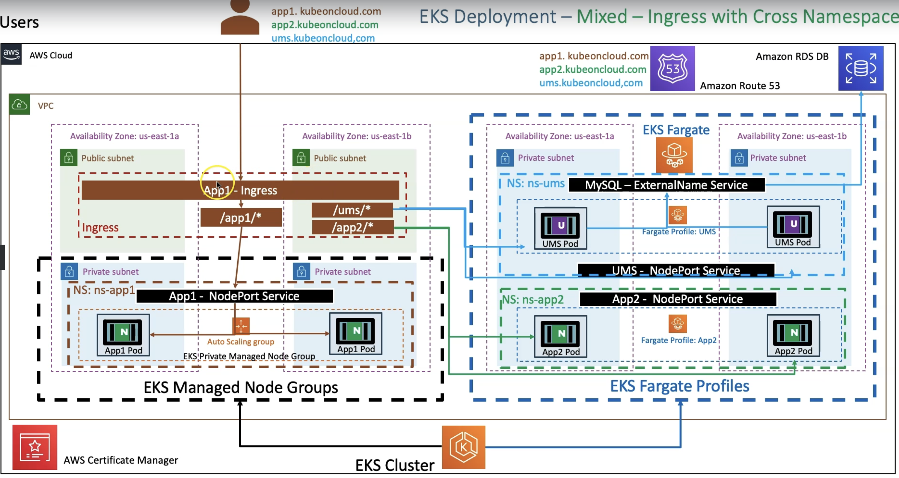

# AWS::EKS::FargateProfile

- Run workloads on `Serverless Fargate Profiles` (instead of EC2 instances)
- With fargate, it's not necessary to configure and manage node groups (and auto scaling groups)
- A `fargate profile` is created with the command `eksctl create fargateprofile`

## Fargate Considerations

- Fargate changes the "conventional" way of how Kubernetes works
- Therefore it applies some architecture constraints that it is important to be aware of
- <https://docs.aws.amazon.com/eks/latest/userguide/fargate.html#fargate-considerations>

- Examples:
  - CLB is not supported
  - Daemonsets are not supported
  - GPUs are not supported
  - Privileged containers are not supported
  - Pods can only run on private subnets
  - Stateful apps are not recommended

## Fargate Controller

- The `Fargate Controller` runs on the control plane
  - It is responsible for scheduling pods into the fargate "nodes"

## Fargate Instance (Host)

- It's the equivalent for a "Node" in the fargate world
- Fargate instances are created "on-the-fly" for each new pod, therefore it may take longer to start
- Each pod runs in an `isolated compute environment`
  - That means that if you have 5 pods you will see 5 EC2 Fargate Instance in `kubectl get no`
- Fargate instances do not have the concept of `NodePorts`
- Fargate instance appear in `kubectl ge no` in the format `fargate-ip-192-168-65-194.ec2.internal`

## Selector Namespace

- A `selector_namespace` specifies which namespace will have its resources deployed to fargate instances
- All objects (e.g., pods) deployed to this specific namespace is scheduled to fargate instances
- It's also possible to define `selector_labels` on top of the `selector_namespace` so that only workflows with certain label AND in the specified namespace will be scheduled onto Fargate

- A `Role` `FargatePodExecutionRole` is created in the specified namespace

## Resources (Requests and Limits)

- It's highly recommended to provide `spec.containers[].resources` (requests and limits)
- If it is not set, a huge fargate instance may be spun up for a pod that uses few resources or vice-versa

## Mixed Mode

- It's possible to mixed up `Managed Node Groups` and `Fargate Profiles` in the same EKS cluster



## Billing

- The unit of charge in Fargate Profile is the pod
- The more pods you have, the more you will be charged

## Properties

```yaml
Type: AWS::EKS::FargateProfile
Properties:
  ClusterName: String
  FargateProfileName: String
  PodExecutionRoleArn: String
  Selectors:
    - Selector
  Subnets:
    - String
  Tags:
    - Tag
```
