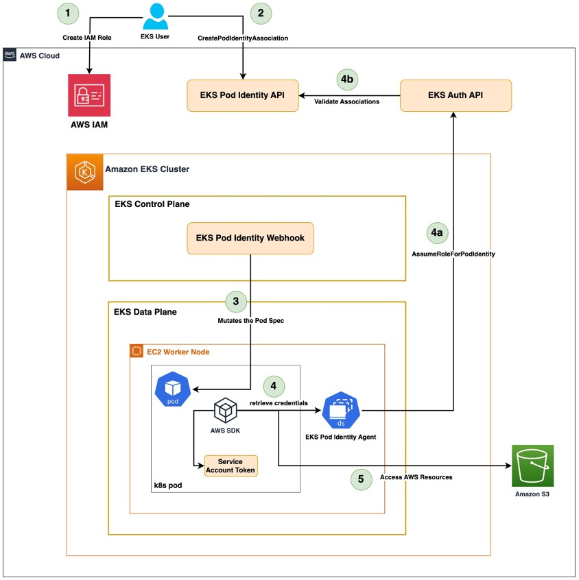

# AWS::EKS::PodIdentityAssociation

- Grants access to AWS Resources by Kubernetes Workloads
- It's a newer alternative to IRSA



## EKS Pod Identity APIs

- `CreatePodIdentityAssociation`: To create the connection between IAM role and SA
- `AssumeRoleForPodIdentity`: For a pod (via SDK) to assume a role

## EKS Pod Identity webhook

- This webhook runs on the Amazon EKS cluster’s control plane,
- It intercepts any pods running with a given SA (that is associated with a IAM role) mutates the pod spec by adding some envs
  - `AWS_CONTAINER_CREDENTIALS_FULL_URI`
  - `AWS_CONTAINER_AUTHORIZATION_TOKEN_FILE`
- Theses envs are used by AWS SDK in order to authenticate with AWS. This search for the credentials is called `credential provider chain`
- Given the envs, the SDK calls the AWS_CONTAINER_CREDENTIALS_FULL_URI which runing on the `Amazon EKS Pod Identity Agent` to get the temporary credentials

## EKS Pod Identity Agent

- It is an addon **Amazon EKS Pod Identity Agent**, which runs a `eks-pod-identity-agent` as DaemonSet in every node
- This agent is exposed on the URI `AWS_CONTAINER_CREDENTIALS_FULL_URI`
- It calls the EKS Auth API `AssumeRoleForPodIdentity` to exchange the projected token for temporary IAM credentials, which are then made available to the pod.
- EKS Auth API (AssumeRoleForPodIdentity) decodes the JWT token and validates the role associations with the service account.
- If valid, it will also set `session tags` such as
  - kubernetes-namespace
  - kubernetes-service-account
  - eks-cluster-arn
  - eks-cluster-name
  - kubernetes-pod-name
  - kubernetes-pod-uid

```shell
# Install the agent via addons
eksctl create addon --name eks-pod-identity-agent --cluster foo
```

> The agent runs in host network mode and gets its permissions from the "arn:aws:iam::aws:policy/AmazonEKSWorkerNodePolicy" managed policy that is attached to the worker roles

## Association

- This connection is done using eksctl
- The API `CreatePodIdentityAssociation` is used under the hood to perform the association of an IAM role with a SA
- The same IAM role can be reused to associate with `multiple SAs` across namespaces within a cluster, or across EKS clusters within an AWS Account.
- Use the command `eksctl create podidentityassociation` to create the association between `IAM Role` and `Service Account`

### IAM Trust Policy

> The IAM role with this trust policy is automatically created with "eksctl create podidentityassociation"

```json
{
  "Version": "2012-10-17",
  "Statement": [
    {
      "Effect": "Allow",
      "Action": [
        "sts:AssumeRole",
        "sts:TagSession"
      ],
      "Principal": {
        "Service": "pods.eks.amazonaws.com"
      },
      "Condition": {
        "StringEquals": {
          "aws:SourceAccount": "my-account-number" // optional
        },
        "ArnEquals": {
          "aws:SourceArn": "arn-of-my-eks-cluster" // optional
        }
      }
    }
  ]
}
```
