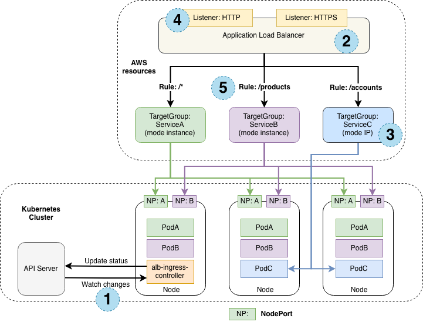
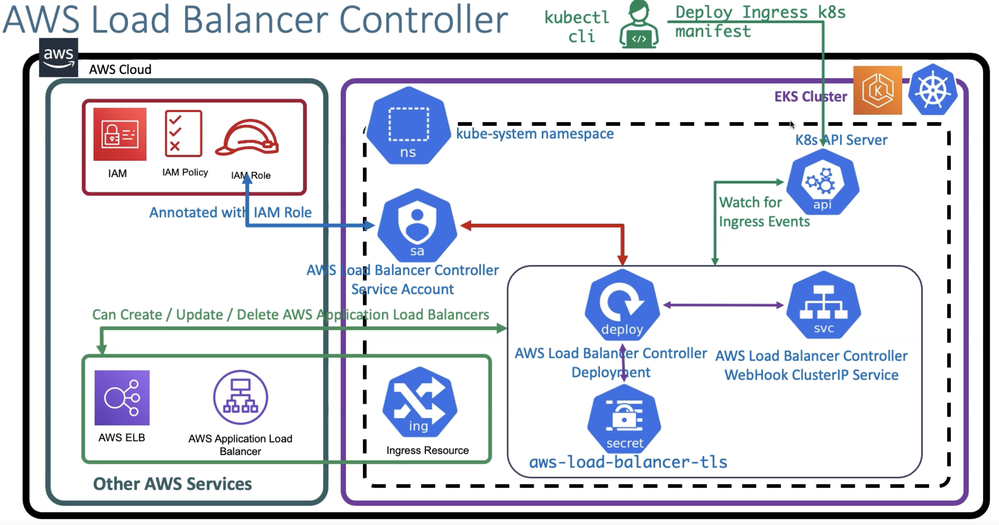

# aws-load-balancer-controller

> This controller is required for Ingress objects only. It creates ALB resources on AWS based on Ingress Objects
> For Service objects this controller is not required (although it can also be used). Service Objects (type LoadBalancer) support is built-in and creates CLBs or NLBs resources on AWS.

- Automatically created ALBs or NLBs based on Ingress Kubernetes Objects
  - `K8S Ingress Object` -> `AWS ALB`
  - `K8S Service Object` -> `AWS NLB`
- <https://kubernetes-sigs.github.io/aws-load-balancer-controller>
- This controller was previously named "aws-alb-ingress-controller"




## IRSA

- The controller runs on the worker nodes, so it needs access to the `AWS ALB/NLB` APIs with IAM permissions
- The IAM permissions can either be setup using `IAM roles for service accounts (IRSA)` (preferred) or can be attached directly to the `worker node IAM roles`

- You can define the required IRSA with eksctl manifest

```yaml
iam:
  withOIDC: true
  serviceAccounts:
    - metadata:
        name: aws-load-balancer-controller
        namespace: kube-system
      wellKnownPolicies:
        awsLoadBalancerController: true
```

- Or create it manually

```shell
# Create an OIDC provider
eksctl utils associate-iam-oidc-provider --cluster my-cluster --approve

# Download Policy
curl -o iam-policy.json https://raw.githubusercontent.com/kubernetes-sigs/aws-load-balancer-controller/v2.10.0/docs/install/iam_policy.json

# Create IAM policy
aws iam create-policy \
  --policy-name AWSLoadBalancerControllerIAMPolicy \
  --policy-document file://iam-policy.json

# Create IRSA
set account_id (aws sts get-caller-identity --query Account --output text)
eksctl create iamserviceaccount \
  --name aws-load-balancer-controller \
  --cluster my-cluster \
  --namespace kube-system \
  --attach-policy-arn=arn:aws:iam::$account_id:policy/AWSLoadBalancerControllerIAMPolicy \
  --override-existing-serviceaccounts \
  --approve
```

## Installation

```shell
helm repo add eks https://aws.github.io/eks-charts
helm repo update eks
helm install aws-load-balancer-controller eks/aws-load-balancer-controller \
  --namespace kube-system \
  --set "clusterName=my-cluster" \
  # do not create SA because it has already been created when creating the IRSA
  --set "serviceAccount.create=false" \
  # SA that was created as part of the IRSA creation
  --set "serviceAccount.name=aws-load-balancer-controller"
```

## Ingress Traffic

- AWS Load Balancer controller supports two traffic modes
- It's configured with the annotation `alb.ingress.kubernetes.io/target-type`

### Instance Mode (default)

- `alb.ingress.kubernetes.io/target-type: instance`
- Register the nodes (ec2 instances) as targets for the ALB
- Traffic is routed to the `NodePort` of each node

### IP Mode

- `alb.ingress.kubernetes.io/target-type: ip`
- Register pods as targets (instead of the nodes)
- This option is mandatory for Fargate profiles because fargate nodes do not support NodePort services
