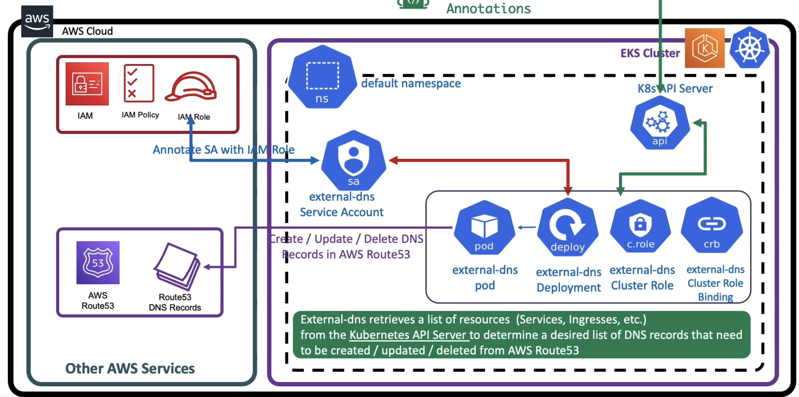

# external-dns

- <https://github.com/kubernetes-sigs/external-dns>
- This is not an AWS controller, but it supports aws
- Check the external-dns docs directly for more details
- If your domain has been registered somewhere else you need first to create a HostedZone (`AWS::Route53::HostedZone`) for it in AWS. If the domain has been registered in AWS, the HostedZone has already been created automatically



## Permissions

- The DNS controller pods need access to `Route 53` in order to manage DNS records

### IRSA

```json
// Customer Managed Policy
{
  "Version": "2012-10-17",
  "Statement": [
    {
      "Effect": "Allow",
      "Action": [
        "route53:ChangeResourceRecordSets"
      ],
      "Resource": [
        "arn:aws:route53:::hostedzone/"
      ]
    },
    {
      "Effect": "Allow",
      "Action": [
        "route53:ListHostedZones",
        "route53:ListResourceRecordSets",
        "route53:ListTagsForResource"
      ],
      "Resource": [
        "*"
      ]
    }
  ]
}
```

```shell
# Create an OIDC provider
eksctl utils associate-iam-oidc-provider --cluster foo --approve

# Create IAM policy
aws iam create-policy \
  --policy-name AllowExternalDNSUpdates \
  --policy-document file://iam_policy.json

# Create IRSA
set account_id (aws sts get-caller-identity --query Account --output text)
eksctl create iamserviceaccount \
  --name external-dns \
  --cluster foo \
  --namespace default \
  --attach-policy-arn=arn:aws:iam::$account_id:policy/AllowExternalDNSUpdates \
  --override-existing-serviceaccounts \
  --approve
```

## Installation

```yaml
apiVersion: rbac.authorization.k8s.io/v1
kind: ClusterRole
metadata:
  name: external-dns
rules:
  - apiGroups: [""]
    resources: ["services", "endpoints", "pods"]
    verbs: ["get", "watch", "list"]
  - apiGroups: ["extensions", "networking.k8s.io"]
    resources: ["ingresses"]
    verbs: ["get", "watch", "list"]
  - apiGroups: [""]
    resources: ["nodes"]
    verbs: ["list", "watch"]
---
apiVersion: rbac.authorization.k8s.io/v1
kind: ClusterRoleBinding
metadata:
  name: external-dns-viewer
roleRef:
  apiGroup: rbac.authorization.k8s.io
  kind: ClusterRole
  name: external-dns
subjects:
  - kind: ServiceAccount
    name: external-dns # the SA created by the eksctl create iamserviceaccount command
    namespace: default
---
apiVersion: apps/v1
kind: Deployment
metadata:
  name: external-dns
spec:
  strategy:
    type: Recreate
  selector:
    matchLabels:
      app: external-dns
  template:
    metadata:
      labels:
        app: external-dns
    spec:
      serviceAccountName: external-dns
      containers:
        - name: external-dns
          image: k8s.gcr.io/external-dns/external-dns:v0.15.0
          args:
            - --source=service
            - --source=ingress
            # - --domain-filter=foo.hvitoi.com # will make ExternalDNS see only the hosted zones matching provided domain, omit to process all available hosted zones
            - --provider=aws
            # - --policy=upsert-only # would prevent ExternalDNS from deleting any records, omit to enable full synchronization
            - --aws-zone-type=public # only look at public hosted zones (valid values are public, private or no value for both)
            - --registry=txt
            - --txt-owner-id=my-hostedzone-identifier
      securityContext:
        fsGroup: 65534 # For ExternalDNS to be able to read Kubernetes and AWS token files
```

## Annotations

- Annotations for Ingress and Service objects are exactly the same

```yaml
apiVersion: networking.k8s.io/v1
kind: Ingress
metadata:
  name: my-ing
  annotations:
    # these records are added to the HostedZone
    # A records that point to the IP of the LoadBalancer (probably created via aws-load-balancer-controller)
    # TXT records are also added
    external-dns.alpha.kubernetes.io/hostname: foo.hvitoi.com, bar.hvitoi.com
    external-dns.alpha.kubernetes.io/ttl: 10
spec:
  ingressClassName: my-aws-ingress-class
  defaultBackend:
    service:
      name: my-svc-nodeport
      port:
        number: 80
```
