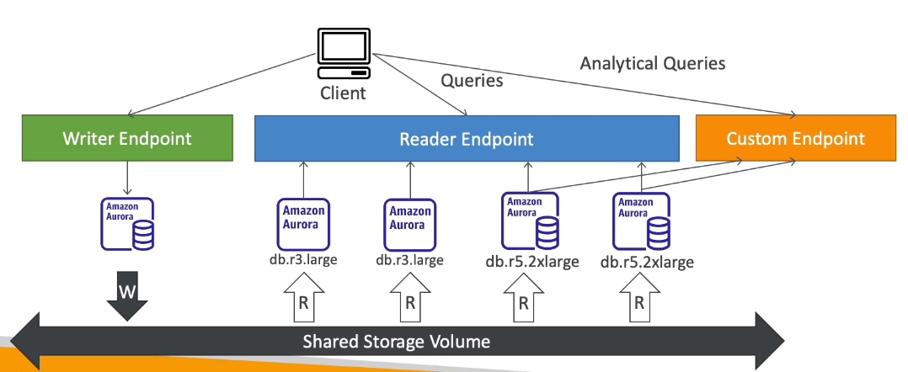
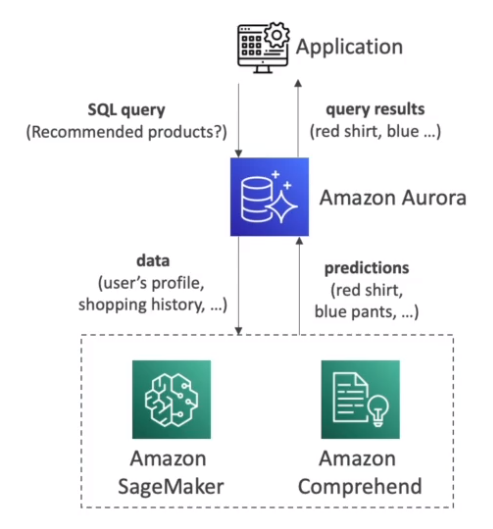

# Aurora

- Proprietary database technology (AWS-owned)
- Compatible with Postgres and MySQL drivers
- Cloud optimized (`5x performance` over MySQL)
- `Shared Storage Volume` that grows automatically up to 128TB (at 10GB steps)
- 20% more expensive

## Write modes

- `One writer + Multiple readers`
- `One writer + Multiple readers` (parallel query)
- `Multiple writers`
- `Serverless`: pay per usage only!

## Replication & Disaster Recovery

- Master (write) + `Up to 15 Read replicas` with faster sync
- Automatic `failover`. Failover is immediate if **multi-master** is enabled

- `Cross Region Replication`: useful for disaster recovery
- `Aurora Global Database`
  - 1 Primary Region (RW)
  - 5 Secondary Regions (RO) - with up to 15 replicas in each
  - Less than 1 second lag
  - RTO (`recovery time objective`) of 1 min. For disaster recovery

- **Priority Tier**
  - Each `Read Replica` is associated with a `priority tier` (0-15)
  - In the event of a failover, the Read Replica that has the highest priority will be promoted
  - If two or more Replicas share the same priority, the replica with largest size is used

## Endpoints & Autoscaling

- There is a `writer endpoint` and `reader endpoint` (load balanced)
- The read replicas can be `auto-scaled` and accessed through a `proxy fleet`

- Some read instances can also be configured with a custom endpoint (e.g., for special analytical queries)
- It's a good practice to define many custom endpoints for different workload types (query only a `subset` of the instances)

## Machine Learning

- ML-based predictions using SQL language
- Services
  - `Amazon SageMaker`: any model
  - `Amazon Comprehend`: sentiment analysis
- Use cases
  - Fraud detection
  - Ads targeting
  - Sentiment analysis
  - Product recommendations

