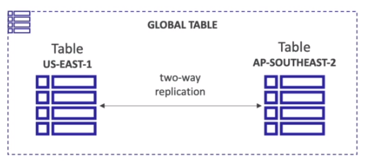

# AWS::DynamoDB::GlobalTable

- Table across multiple regions
- Representations of the table in multiple regions and automatically synchronize/replicate across them
- Two-way replication across the tables
- DynamoDB Streams must be enabled in order to sync the tables



## Properties

- <https://docs.aws.amazon.com/AWSCloudFormation/latest/UserGuide/aws-resource-dynamodb-globaltable.html>

```yaml
Type: AWS::DynamoDB::GlobalTable
Properties:
  AttributeDefinitions:
    - AttributeDefinition
  BillingMode: String
  GlobalSecondaryIndexes:
    - GlobalSecondaryIndex
  KeySchema:
    - KeySchema
  LocalSecondaryIndexes:
    - LocalSecondaryIndex
  Replicas:
    - ReplicaSpecification
  SSESpecification:
    SSESpecification
  StreamSpecification:
    StreamSpecification
  TableName: String
  TimeToLiveSpecification:
    TimeToLiveSpecification
  WriteOnDemandThroughputSettings:
    WriteOnDemandThroughputSettings
  WriteProvisionedThroughputSettings:
    WriteProvisionedThroughputSettings
```
