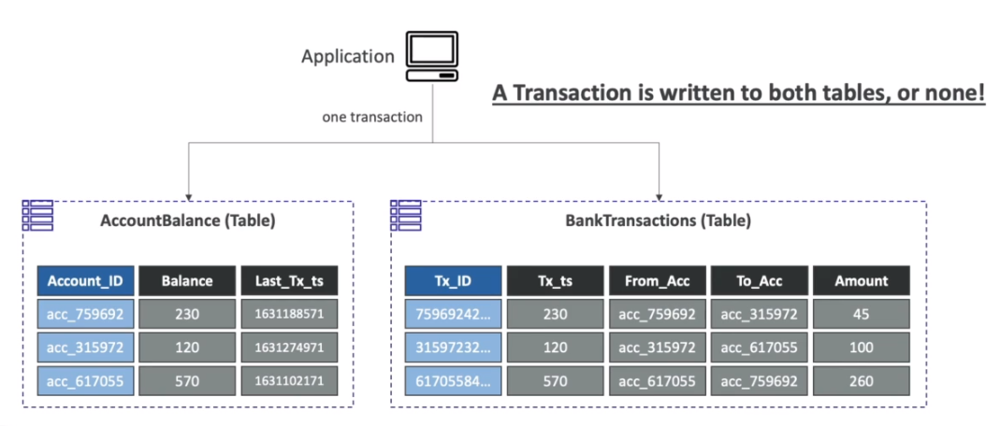
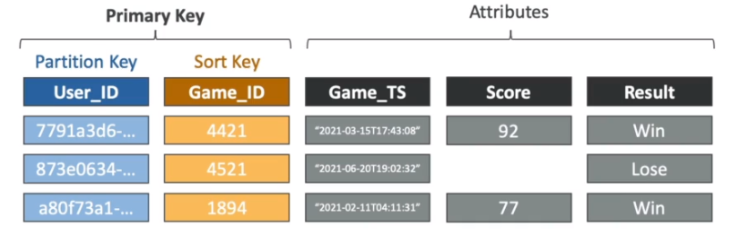

# AWS::DynamoDB::Table

- Serverless `NoSQL database`
- Multi-AZ
- Integration with IAM for authentication & authorization

- Structure
  - DynamoDB is made of `Tables` (Collection)
  - Each table can have infinite number of `Items` (Document). With maximum size of 400KB
  - Each item has `Attributes` (Field)

## Features

- On demand backup
- PITR recovery
- SQL developer tools
- Time to live (TTL)
- In-memory performance
- ACID transactions

- Integrations
  - DynamoDB streams and Kineses Data Streams
  - CloudWatch

## Transactions

- Write to two tables at the same time or none
- Available as of 2018
- Does not use locks! It just fails if any item is modified during the transaction
- You should design your system to handle these `write collisions`
- Limited to `25 items` per transaction
- Transactions lead to `double to the cost`. Given that an additional read have to be done to ensure the item hasn't changed (read + commit)
- Uses the `TransactGetItems` and `TransactWriteItems` APIs



## Expressions

- <https://docs.aws.amazon.com/amazondynamodb/latest/developerguide/Expressions.OperatorsAndFunctions.html>
- Expressions
  - `Condition expression`: specify which items should be modified
  - `Filter expression`
- Those can be used in `PutItem`, `UpdateItem`, and `DeleteItem`

## APIs

### Read

#### Scan

- Scan the whole table to find an item
- Consumes lots of RCU
- **filter expressions** are applicable only for `scan` and `query` operations

```python
import boto3
from boto3.dynamodb.conditions import Key

def lambda_handler(event, context):
  client = boto3.resource('dynamodb')
  table = client.Table('MyTable')

  # filter expression can be any attribute (not only hash or sort key)
  response = table.scan(
    FilterExpression = Attr('MyKey').eq('USA')
  )

  response = table.scan(
    FilterExpression =
      Attr('MyKey').eq('USA') &
      Attr('MyKey').begins_with('2019')
  )
```

#### Query

- Returns a list of items
- Query operations require at least a `hash key`
- Additionally you can use `filter expressions` to query based on other fields that are not hash/range keys
- It's like a scan but within a partition only

```python
import boto3
from boto3.dynamodb.conditions import Key

def lambda_handler(event, context):
  client = boto3.resource('dynamodb')
  table = client.Table('MyTable')

  response = table.query(
    KeyConditionExpression =
      Key('MyPartitionKey').eq('Lala') &
      Key('MySortKey ').gt('2019-01-01')
  )
```

#### GetItem

- Returns one specific item
- Requires the `hash key` and the `range key` (if any)

```python
import boto3
from boto3.dynamodb.conditions import Key

def lambda_handler(event, context):
  client = boto3.resource('dynamodb')
  table = client.Table('MyTable')

  response = table.get_item(
    Key = {
      'MyPartitionKey': 'Lala',
      'MySortKey': '2019-11-17'
    }
  )
```

#### TransactGetItems

- Get multiple items in multiple tables at once. If during this process one items changes, the whole transaction fails

### Write

#### PutItem

```shell
aws dynamodb update-item \
    --table-name "proposals" \
    --key '{"status": {"S": "open"}, "expires-at": {"S": "???now"}}' \
    --update-expression "SET status = expires" \
    --expression-attribute-values '{"nextStartTime": { "N": "4"}}'
```

#### BatchWriteItems

- Allow partial write (if any of the data changes during the operation)

#### TransactWriteItems

- Write to multiple items in multiple tables at once. If any item modifies while the operation is taking place, the whole transaction is aborted

## Properties

- <https://docs.aws.amazon.com/AWSCloudFormation/latest/UserGuide/aws-resource-dynamodb-table.html>

```yaml
Type: AWS::DynamoDB::Table
Properties:
  AttributeDefinitions:
    - AttributeDefinition
  BillingMode: String
  ContributorInsightsSpecification:
    ContributorInsightsSpecification
  DeletionProtectionEnabled: Boolean
  GlobalSecondaryIndexes:
    - GlobalSecondaryIndex
  ImportSourceSpecification:
    ImportSourceSpecification
  KeySchema:
    - KeySchema
  KinesisStreamSpecification:
    KinesisStreamSpecification
  LocalSecondaryIndexes:
    - LocalSecondaryIndex
  OnDemandThroughput:
    OnDemandThroughput
  PointInTimeRecoverySpecification:
    PointInTimeRecoverySpecification
  ProvisionedThroughput:
    ProvisionedThroughput
  ResourcePolicy:
    ResourcePolicy
  SSESpecification:
    SSESpecification
  StreamSpecification:
    StreamSpecification
  TableClass: String
  TableName: String
  Tags:
    - Tag
  TimeToLiveSpecification:
    TimeToLiveSpecification
```

### KeySchema

- Each table has `Partition Key` (hash) and an optional `Sort Key` (range)
- Partition Key
  - It's used as input to the hashing function
  - The output of the hashing function will tell to which physical partition the item will go
  - Same partition key goes to same partition (similar to kafka)
  - This speeds the lookup, given that with the partition key it's possible to know in which partition the data is stored
- Sort key
  - It's used to tell where dynamo will store the data inside of the partition
  - This way, the values for the same partition key can be sorted physically within a partition
- The combination of both is the `Primary Key`



### GlobalSecondaryIndexes

- Creating a GSI clones the table using a new partition key (`GSI Partition Key`) and optionally a new sort key
  - The main table and the GSI tables are kept in-sync
  - The original partition key becomes a conventional attribute in the GSI Table
- On the `GSI table` you can then `query on attributes` (the GSI partition key) that is not original partition key or sort key
  - More efficient! Avoids scanning the whole table
- The RCU / WCU is defined separately for the `GSI table`
- Allows search across partitions
- Writes to the Main Table leads to writes to GSI, which doubles the cost of writing
  - Use the WCU for the GSI equal to the WCU of the main table!
- There we be an inconsistency between the main table and the GSI while it's being sync (`eventual consistency`)
- You can have up to `20 GSIs` per table
- It's not possible to write to an GSI directly. It's used only for read operations. The write to a GSI is executed automatically under the hood when you write to the main table
  - If you need to update by a hash key of the GSI, first you need to get the item by GSI hash key and then use the hash key of the main table to update it

### LocalSecondaryIndexes

- An LSI adds an additional sort key (the `LSI Sort Key`)
- It's an index that has the same partition key as the base table, but a different sort key
- This way, you can fetch the item directly using the partition key + the LSI sort key
- Allows searching within the same partition (or same partition key)
- Can only be defined at table creation time
- No extra cost! (this doesn't clone the table like GSI does)
- You can have up to `5 LSIs` per table

### AttributeDefinitions

- Define all the attributes that are going to be used for query
- Each attribute defined here must be either in KeySchema or GlobalSecondaryIndexes
- Attribute created on-the-fly cannot be used for searching

- **Data types**
  - `Scalar Types`: String, Number, Binary, Boolean, Null
  - `Document Types`: List, Map
  - `Set Types`: String Set, Number Set, Binary Set

```json
{
  "my-string": {
    "S": "aa"
  },
  "my-number": {
    "N": "0"
  },
  "my-boolean": {
    "BOOL": false
  },
  "my-binary": {
    "B": ""
  },
  "my-null": {
    "NULL": true
  },
  "my-string-set": {
    "SS": ["aa", "bb", "cc"]
  },
  "my-number-set": {
    "NS": ["0", "1", "2"]
  },
  "my-binary-set": {
    "BS": ["", ""]
  },
  "my-list": {
    "L": [
      {
        "S": "aa"
      },
      {
        "N": "0"
      }
    ]
  },
  "my-map": {
    "M": {
      "key1": {
        "S": "aa"
      },
      "key2": {
        "N": "0"
      }
    }
  }
}
```

### BillingMode

- It's how to control the table's `capacity` (read/write throughput)

- **Provisioned Mode** (default)
  - `RCU`: read capacity unit
  - `WCU`: write capacity unit
  - `Consumed Capacity`: RCU + WCU consumed so far
  - `Provisioned Capacity`
    - RCU + WCU total provisioned
    - This is actually what you pay for. This is specified beforehand
    - The total capacity unit (read or write) is shared (split equally) for all partitions. Therefore it's important the spread the data evenly across the partitions
  - `Burst Capacity`: an additional pool of capacity that dynamo saves to avoid throttling when the consumed capacity exceeds the provisioned capacity a bit. Usually for random spikes in usage. It's transparent for the user/developer
  - Autoscaling (self adjusting provisioned capacity) can be configured for peak hours. Under the hood, autoscaling in done by cloud watch alarms that trigger a table config update
  - `Adaptive capacity` can also be used. With that, a hot partition can borrow capacity from another idler partition
  - If the capacity is exceeded (`throttling`) dynamo will reject the request
  - There is a hard limit of `3000 RCU` and `1000 WCU` per partition, if you need to go over it you need to use DAX (caching layer)
- **On-Demand Mode**
  - Scales automatically based on the workload
  - More expensive!
  - Useful for very unpredictable workloads

### StreamSpecification

- `DynamoDB Streams` offers an ordered stream of modifications in a table (similar to a Kafka Connector Source)
  - INSERT
  - UPDATE
  - REMOVE
- It's a change data capture (CDC)
- Capture item-level changes in the table and push the changes to DynamoDB streams
- Events are guaranteed in the same order the modification took place
- The change can be accessed through `DynamoDB Streams API`
- Streams can be sent to
  - Kinesis Data Streams (does not guarantee ordering of the events or even duplicate events)
  - AWS Lambda
  - Kinesis Client Library applications
- Data retention `up to 24 hours`
- Use cases:
  - React to changes in real-time (e.g., welcome new users)
  - Analytics
  - Real Time Dashboards
  - Insert into derivative tables
  - Insert into elasticsearch
  - Implement cross-region replication


- The event
  - Keys
  - NewImage
  - OldImage
  - NewImage & OldImage

```json
{
  "Records": [
    {
      "eventId": "1",
      "eventName": "INSERT",
      "eventVersion": "1.0",
      "eventSource": "aws:dynamodb",
      "awsRegion": "us-east-1",
      "dynamodb": {
        "NewImage": {
          "playerId": {
            "S": "11111"
          },
          "date": {
            "S": "Aug 10 2022 10:00:00"
          },
          "score": {
            "N": "100"
          }
        }
      },
      "eventSourceARN": "MyTableARN"
    }
  ]
}
```

- IAM role setup
  - For lambda you can use the pre-built policy `AWSLambdaDynamoDBExecutionRole`

```json
{
  "Version": "2012-10-17",
  "Statement": [
    {
      "Effect": "Allow",
      "Action": [
        // to access the dynamodb stream
        "dynamodb:DescribeStream",
        "dynamodb:GetRecords",
        "dynamodb:GetShardIterator",
        "dynamodb:ListStreams",
        // to log on cloud watch
        "logs:CreateLogGroup",
        "logs:CreateLogStream",
        "logs:PutLogEvents"
      ],
      "Resource": "*"
    }
  ]
}
```

### TimeToLiveSpecification

- TTL
- Automatically expire an item using a `timestamp` key that can be configured
  - The timestamp key must be in `epoch seconds` format
  - Stores the time when it will be expired
  - Must be `N` type key (number)
- The deletion is not immediate. It can take up to 48 hours. If the table is long it can take even longer. Don't rely on it.
- Free! Does not consume write throughput
- Consumes `burst capacity`. That means that if the burst capacity is over, the deletion will be delay until it's recovered

### PointInTimeRecoverySpecification

- Snapshots of the table that allows reverting back to a specific point in time
