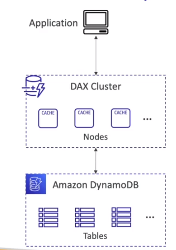

# AWS::DAX::Cluster

- **DynamoDB Accelerator (DAX)**

- In-memory `cache` for DynamoDB
- No need to change any code (compatible with existing DynamoDB APIs)
- Defaults to `5 min TTL`



## Properties

- <https://docs.aws.amazon.com/AWSCloudFormation/latest/UserGuide/aws-resource-dax-cluster.html>

```yaml
Type: AWS::DAX::Cluster
Properties:
  AvailabilityZones:
    - String
  ClusterEndpointEncryptionType: String
  ClusterName: String
  Description: String
  IAMRoleARN: String
  NodeType: String
  NotificationTopicARN: String
  ParameterGroupName: String
  PreferredMaintenanceWindow: String
  ReplicationFactor: Integer
  SecurityGroupIds:
    - String
  SSESpecification:
    SSESpecification
  SubnetGroupName: String
  Tags:
    - Tag
```
