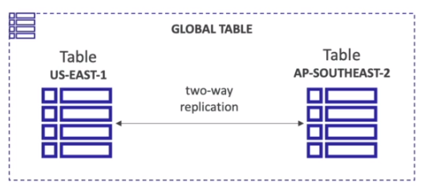

# AWS::DynamoDB::GlobalTable

- Table across multiple regions
- Representations of the table in multiple regions and automatically synchronize/replicate across them
- Two-way replication across the tables
- DynamoDB Streams must be enabled in order to sync the tables

